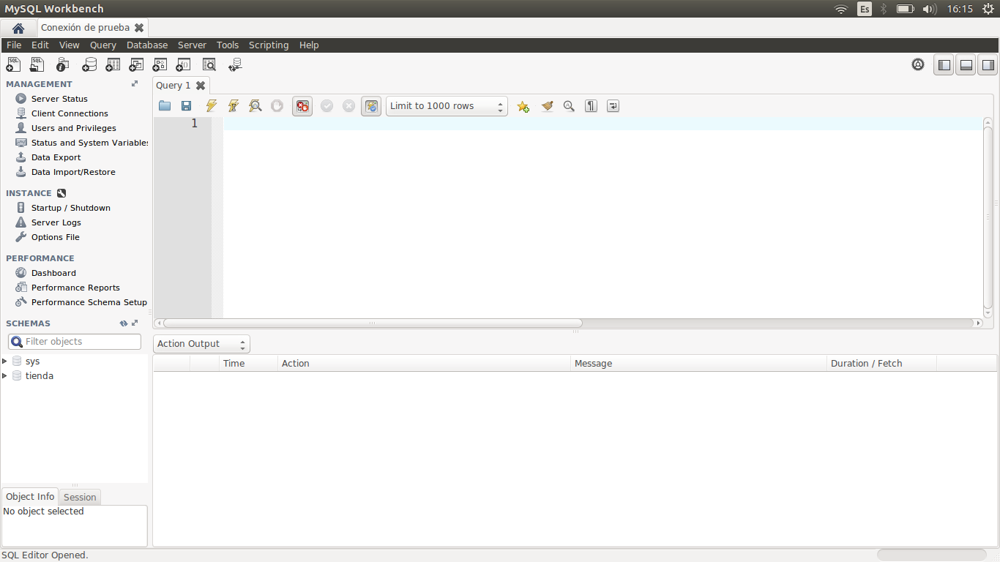
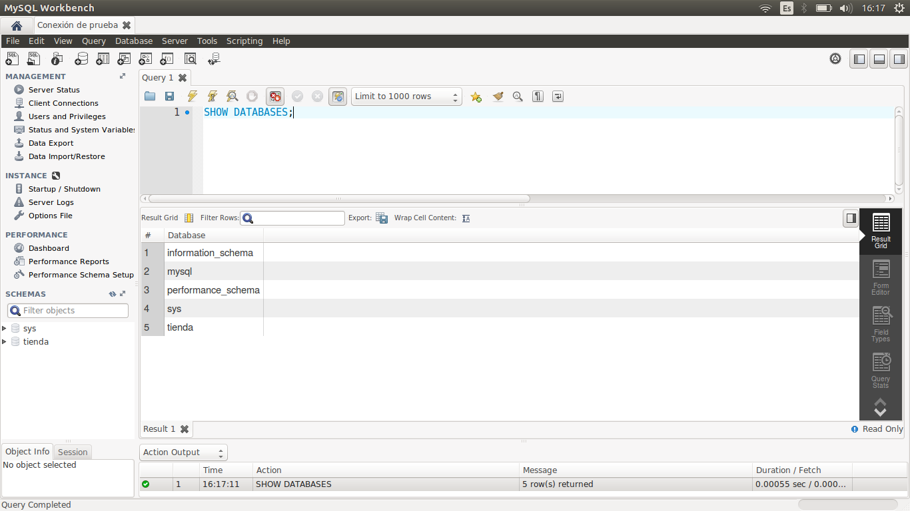
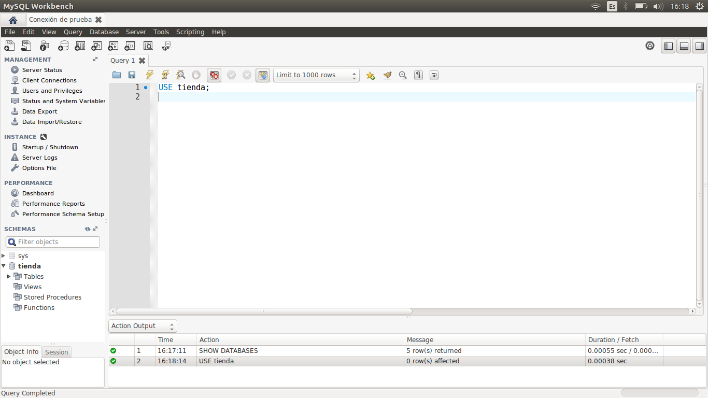
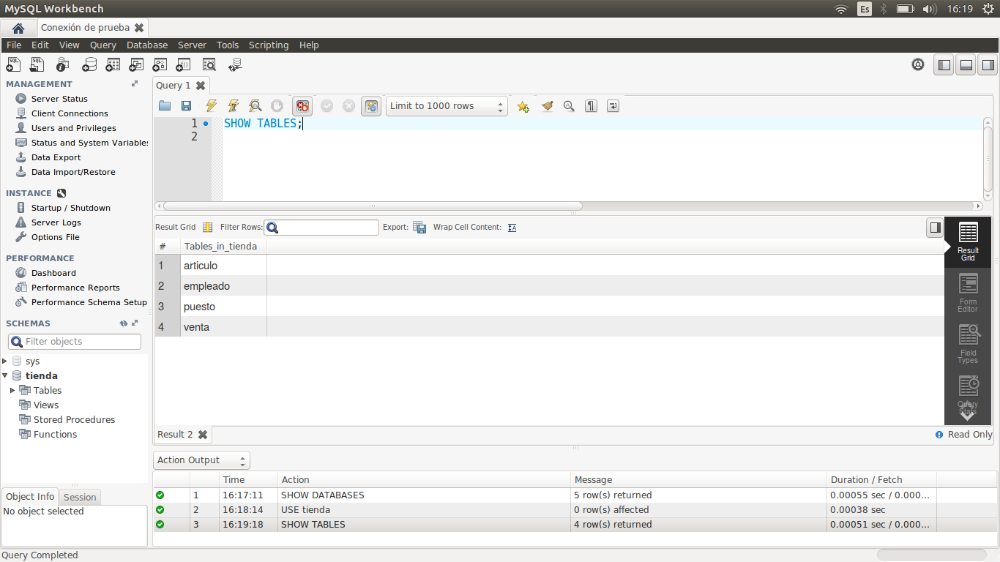
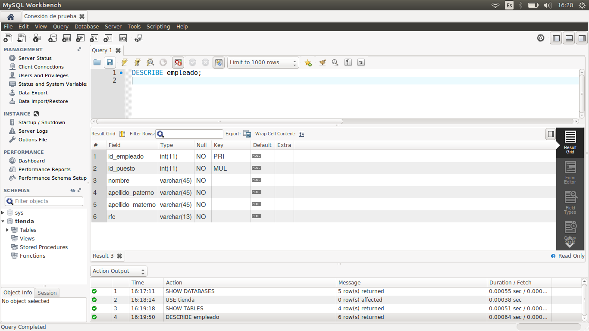

[`Introducción a Bases de Datos`](../../Readme.md) > [`Sesión 01`](../Readme.md) > `Ejemplo 02`

## Ejemplo 2: Estructura de una tabla

<div style="text-align: justify;">

### 1. Objetivos :dart:

- Listar las bases de datos (esquemas) en un servidor de bases de datos y a conectarse a las mismas.
- Listar las tablas dentro de un esquema.
- Usar la instrucción `DESCRIBE` para mostrar la estructura de una tabla y los tipos de datos de sus campos.

### 2. Requisitos :clipboard:

1. Conexión al servidor de bases de datos que se configuró en el Ejemplo 1.
2. MySQL Workbench instalado.

### 3. Desarrollo :rocket:

1. Una vez realizada la conexión al servidor de bases de datos, se tiene la siguiente pantalla dentro de Workbench. En ella se muestra un editor de texto llamado *Query 1*.

   

2. En este editor, listaremos las bases de datos disponibles en el servidor. Para listar las bases de datos del servidor usamos el siguiente comando:

   ```sql
   SHOW DATABASES;
   ```
   
   Se mostrarán las siguientes bases:
   
   

3. La base de datos `tienda` fue creada por nosotros, mientras que el resto de bases de datos son parte del Sistema Gestor de Bases de Datos y no las usaremos de momento.

   Nos conectaremos a la base de datos `tienda`. Para hacer eso, usa el siguiente comando:

   ```sql
   USE tienda;
   ```
 
   

4. La tabla que se muestra abajo del editor, indica que nos hemos conectado a la base de datos `tienda`. Ahora podemos listar las bases de datos contenidas en el esquema. Para ello, usa el siguiente comando:

   ```sql
   SHOW TABLES;
   ```

   

5. Veamos, por ejemplo, cuál es la estructura de la tabla `empleado`. Para ello usa el siguiente comando:

   ```sql
   DESCRIBE empleado;
   ```
   
   Observa el nombre de los campos y el tipo de dato que tienen. Recuerda, el tipo `int` indica que el campo almacena un dato numérico, mientras que el tipo `varchar` indica que los datos son cadenas de caracteres.

   

   La instrucción `DESCRIBE` es tu amiga. La usaremos cada que necesitamos consultar los registros de una tabla, pues nos permitirá saber qué campos tiene y su tipo.

[`Anterior`](../Readme.md#estructura-de-una-tabla) | [`Siguiente`](../Reto-01/Readme.md)

<div style="text-align: justify;">
