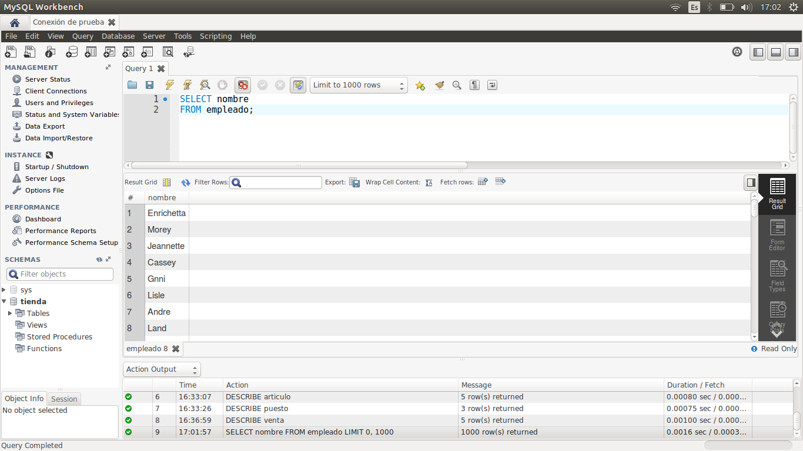
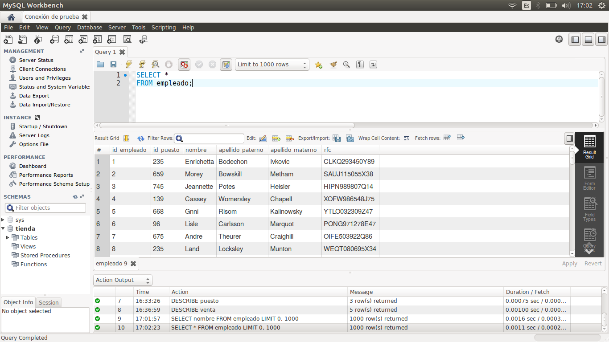
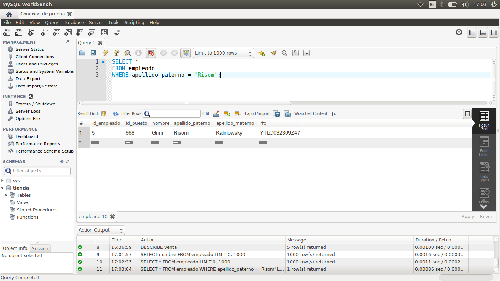
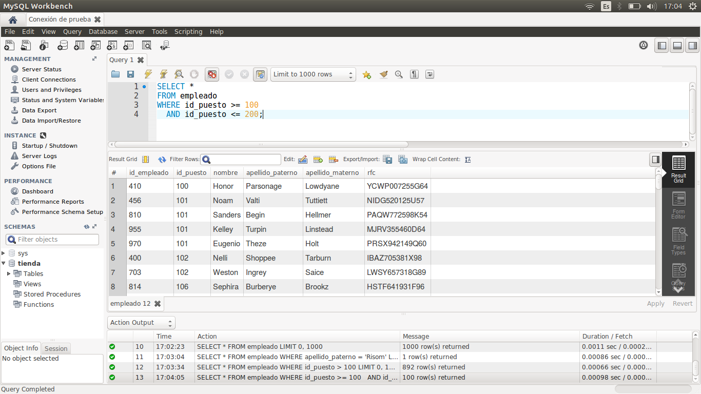
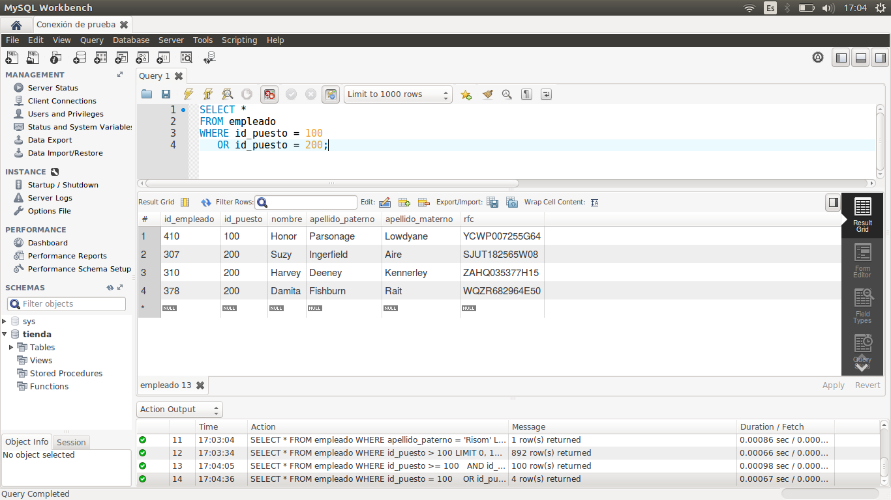
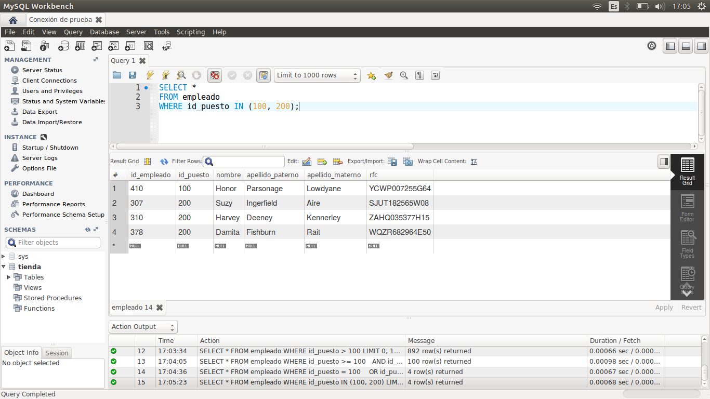

[`Introducción a Bases de Datos`](../../Readme.md) > [`Sesión 01`](../Readme.md) > `Ejemplo 3`

## Ejemplo 3: Estructura básica de una consulta

<div style="text-align: justify;">

### 1. Objetivos :dart:

- Escribir consultas sencillas por medio de `SELECT`.
- Filtrar los resultados de un `SELECT` mediante la restricción `WHERE`.
- Ilustrar el uso de los operadores lógicos, relacionales e `IN`.

### 2. Requisitos :clipboard:

1. Conexión al servidor de bases de datos que se configuró en el Ejemplo 1.
2. MySQL Workbench instalado.

### 3. Desarrollo :rocket:

1. Como recordarás de los ejemplos anteriores, la tabla `ejemplo` incluía un campo `nombre`, vamos a seleccionar (o *proyectar*) los registros de ese campo. Para ello, usa la instrucción:

   ```sql
   SELECT nombre
   FROM empleado;
   ```
   
   

2. Para traer todos los campos, usamos un asterisco en vez de listar todos los campos con la siguiente *consulta*:

   ```sql
   SELECT *
   FROM empleado;
   ```
   
   Se mostrarán las siguientes bases:
   
   

3. Ahora, filtremos todos los usuarios cuyo apellido paterno sea `Risom`. Para ello, usamos `WHERE` como sigue:

   ```sql
   SELECT *
   FROM empleado
   WHERE apellido_paterno = 'Risom';
   ```
 
   

4. También podemos usar operadores relacionales, para filtar registros. Por ejemplo, traemos todas los empleados cuyo `id_puesto` es mayor a 100.

   ```sql
   SELECT *
   FROM empleado
   WHERE id_puesto > 100;
   ```

   

5. Podemos combinar filtros, mediante operadores lógicos, por ejemplo, supongamos que queremos todos los rubros cuyo `id_puesto` esté entre 100 y 200, entonces usamos el operador lógico `AND`.

   ```sql
   SELECT *
   FROM empleado
   WHERE id_puesto >= 100
     AND id_puesto <= 200;
   ```

   
   
6. También podemos usar el operador lógico `OR`. Por ejemplo, queremos todos los rubros cuyo `id_puesto` sea 100 o 200.

   ```sql
   SELECT *
   FROM empleado
   WHERE id_puesto = 100
      OR id_puesto = 200;
   ```

   
   
7. Una forma de acortar el `OR` anterior es mediante `IN`. De esta forma, vemos si un campo se encuentra en un *listado de valores*. 

   ```sql
   SELECT *
   FROM empleado
   WHERE id_puesto IN (100,200);
   ```

   

[`Anterior`](../Readme.md#estructura-de-una-consulta) | [`Siguiente`](../Reto-02/Readme.md)

</div>   
