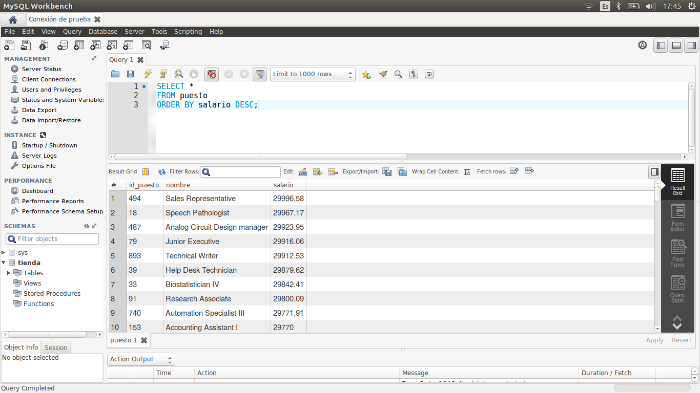
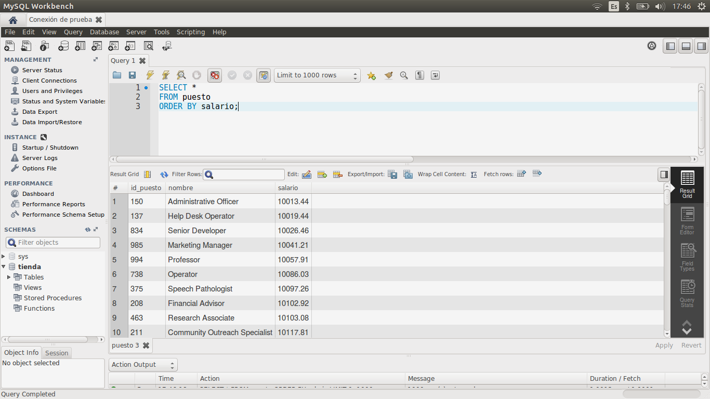
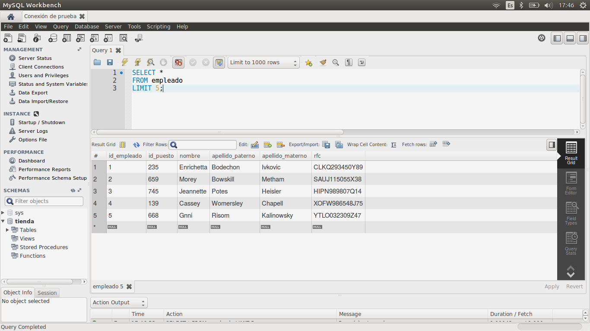

[`Introducción a Bases de Datos`](../../Readme.md) > [`Sesión 01`](../Readme.md) > `Ejemplo 4`

## Ejemplo 4: Ordenamientos y límites

<div style="text-align: justify;">

### 1. Objetivos :dart:

- Ordenar los resultados de una consulta.
- Limitar el número de registros de una consulta.

### 2. Requisitos :clipboard:

1. Conexión al servidor de bases de datos que se configuró en el Ejemplo 1.
2. MySQL Workbench instalado.

### 3. Desarrollo :rocket:

1. Adicional a la restricción `WHERE`, es posible añadir otras restriccioens, por ejemplo, la restricción `ORDER BY` que permite ordenar los resultados de una consulta de manera ascendente (`ASC`) o descendente (`DESC`) a partir de un campo. Por ejemplo, la siguiente consulta muestra los resultados ordenados de mayor a menor a partir del campo `salario`.

   ```sql
   SELECT *
   FROM puesto
   ORDER BY salario DESC;
   ```
   
   

2. Para ordenar de forma ascendente puede añadirse la opción `ASC` u omitirse, pues el ordenamiento por defecto es ascentende.

   ```sql
   SELECT *
   FROM puesto
   ORDER BY salario ASC;
   
   SELECT *
   FROM puesto
   ORDER BY salario;
   ```
   
   

3. Otra restricción es `LIMIT` que permite limitar el número de registros en una consulta. Esto es útil principalmente cuando se tienen miles de millones de registros y no se necesitan mostrar todos.

   ```sql
   SELECT *
   FROM empleado
   LIMIT 5;
   ```
 
   

[`Anterior`](../Readme.md#ordenamientos-y-límites) | [`Siguiente`](../Reto-03/Readme.md)

</div>
