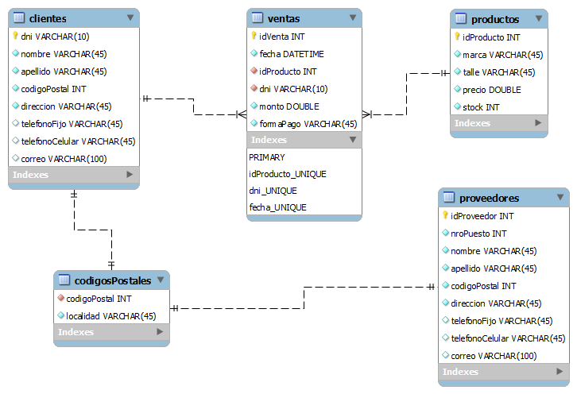

[`Introducción a Bases de Datos`](../Readme.md) > `Sesión 1`

## Sesión 1: Fundamentos de SQL

### 1. Objetivos :dart: 

- Establecer la conexión a una base de datos relacional.
- Analizar la estructura de distintas tablas en una base de datos.
- Escribir consultas básicas que permitan obtener los campos de una tabla, ordenar y limitar los resultados.  

### 2. Contenido :blue_book:

---

#### <ins>Bases de Datos Relacionales</ins>
 

Comenzaremos con la conexión a una base de datos relacional de __MySQL__. Las conexiones a bases de datos se llevan a cabo mediante el llamado *Modelo Cliente-Servidor*.

La información de una base de datos se encuentra alojada en un servidor, por lo general, una computadora de gran potencia. Para conectarnos hacemos uso de un cliente que recibe datos de la base y envía peticiones para cambiar o agregar datos.

> *Explicar el Modelo Cliente-Servidor en pizarrón. Se sugiere usar una analogía con la vida diaria. Ejemplo: El servidor es una casa, para entrar necesitamos una dirección, una llave y un usuario, etc.*

- [**`EJEMPLO 1`**](Ejemplo-01/Readme.md)

---

#### <ins>Estructura de una tabla</ins>
 

Una vez que hemos accedido a un servidor de bases de datos, nos encontramos con un listado de distintas bases, donde cada una contiene *tablas*. Una tabla se compone de:

1. Renglones
1. Columnas
1. Llaves primarias y foráneas.
1. Datos
1. Tipos de datos

Dichas tablas pueden estar relacionadas o no.

> *Explicar cada uno de los elementos que conforman a una tabla haciendo especial énfasis en el uso de llaves y tipos de datos.*

- [**`EJEMPLO 2`**](Ejemplo-02/Readme.md)
- [**`RETO 1`**](Reto-01/Readme.md)

---

#### <ins>Estructura de una consulta</ins>

En su forma más básica una consulta se compone de:

1. Una cláusula `SELECT` que indica los campos de la tabla que se desean obtener.
1. Una cláusula `FROM` que indica de dónde obtener los datos.
1. Una cláusula `WHERE` que representa los filtros que podemos hacerle a los datos.

> *Ejemplificar la estructura de una consulta sencilla y explicar estras tres partes con detalle. Se sugiere dibujar un diagrama el el pizarrón.*

- [**`EJEMPLO 3`**](Ejemplo-03/Readme.md)
- [**`RETO 2`**](Reto-02/Readme.md)

---

#### <ins>Ordenamientos y límites</ins>

Una vez obtenidos los datos requeridos mediante una consulta, es posible ordenarlos o limitar el número de registros mediante las cláusulas:

- `ORDER BY`
- `LIMIT`

> *Definir estas cláusulas y hablar de sus principales aplicaciones.*

- [**`EJEMPLO 4`**](Ejemplo-04/Readme.md)
- [**`RETO 3`**](Reto-03/Readme.md)

---

### 3. Ejercicios de práctica :hammer:

Aplica lo todo lo que aprendiste durante la sesión en estos ejercicios. 

- [**`EJERCICIOS SESIÓN 1`**](Ejercicios/Readme.md)

 

[`Anterior`](../Readme.md) | [`Siguiente`](../Sesion-02/Readme.md)      

