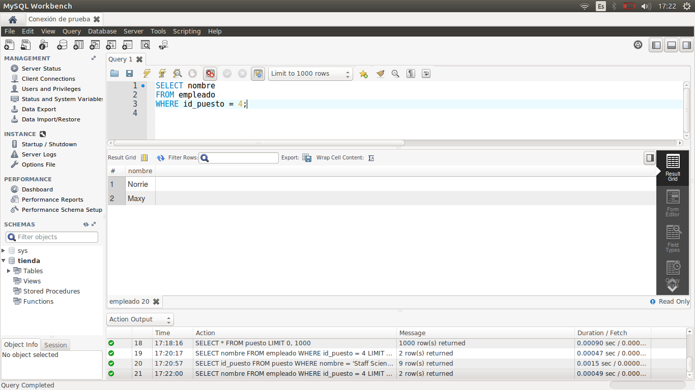
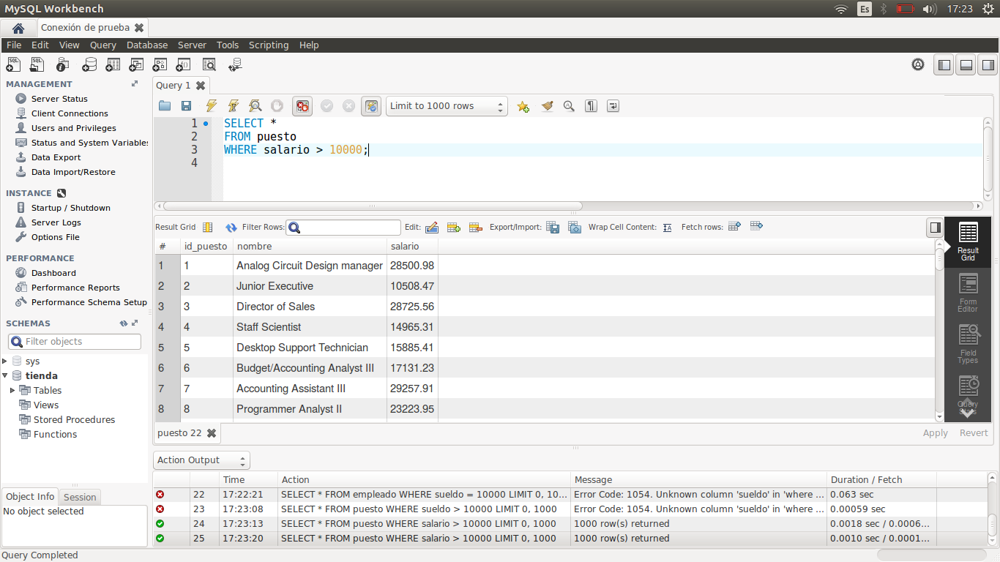
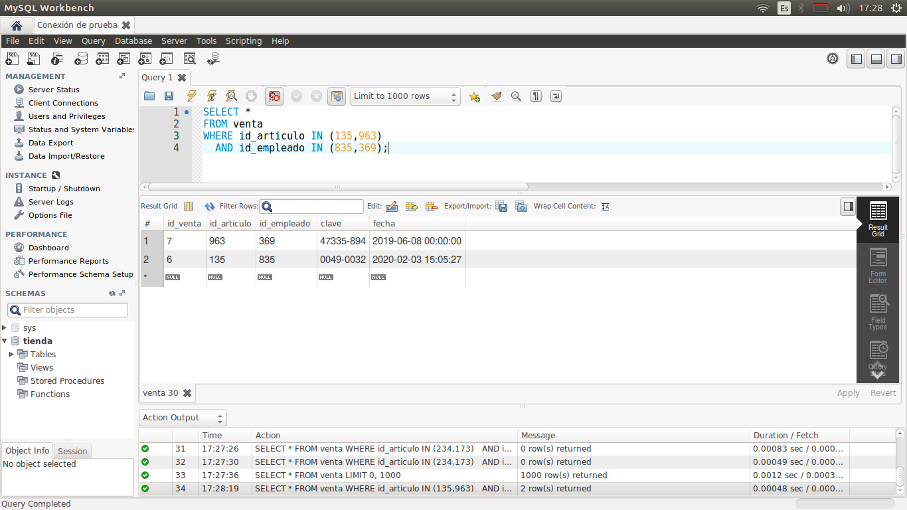

[`Introducción a Bases de Datos`](../../Readme.md) > [`Sesión 01`](../Readme.md) > `Reto 2`
	
## Reto 2: Estructura básica de una consulta

<div style="text-align: justify;">

### 1. Objetivos :dart:

- Escribir consultas que permitan responder a algunas preguntas.

### 2. Requisitos :clipboard:

1. MySQL Workbench instalado.

### 3. Desarrollo :rocket:

Usando la base de datos `tienda`, escribe consultas que permitan responder las siguientes preguntas.

- ¿Cuál es el nombre de los empleados con el puesto 4?
- ¿Qué puestos tienen un salario mayor a $10,000?
- ¿Qué articulos tienen un precio mayor a $1,000 y un iva mayor a 100?
- ¿Qué ventas incluyen los artículo 135 o 963 y fueron hechas por los empleados 835 o 369?

<details><summary>Solución</summary>
<p>

- ¿Cuál es el nombre de los empleados con el puesto 4?

   ```sql
   SELECT nombre
   FROM empleado
   WHERE id_puesto = 4;
   ```
   

- ¿Qué puestos tienen un salario mayor a $10,000?

   ```sql
   SELECT *
   FROM puesto
   WHERE salario > 10000;
   ```
   
   
- ¿Qué articulos tienen un precio mayor a $1,000 y un iva mayor a 100?

   ```sql
   SELECT *
   FROM articulo
   WHERE precio > 1000
     AND iva > 100;
   ```
    
   
- ¿Qué ventas incluyen los artículo 135 o 963 y fueron hechas por los empleados 835 o 369?

   ```sql
   SELECT *
   FROM venta
   WHERE id_articulo IN (135,963)
     AND id_empleado IN (835,369);
   ```
   

</p>
</details> 

<br/>

[`Anterior`](../Ejemplo-03/Readme.md) | [`Siguiente`](../Readme.md#ordenamientos-y-límites)

</div>
