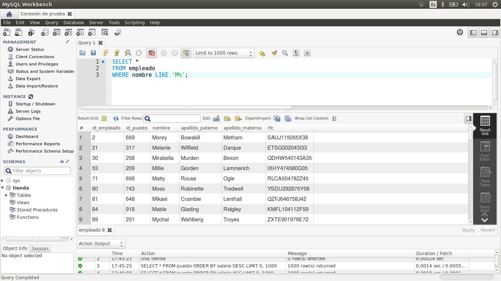
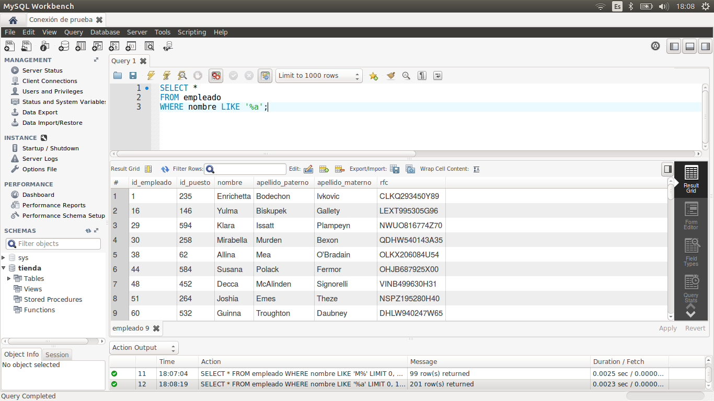
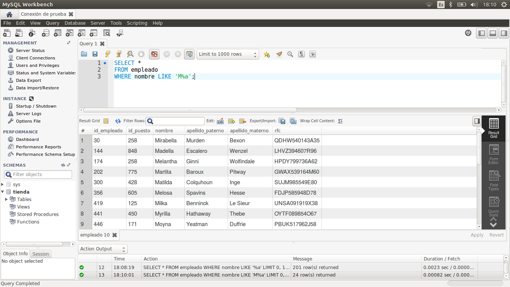

[`Introducción a Bases de Datos`](../../Readme.md) > [`Sesión 02`](../Readme.md) > `Ejemplo 1`

## Ejemplo 1: Selecciones con `LIKE`

<div style="text-align: justify;">

### 1. Objetivos :dart:

- Realizar consultas que hagan uso de la restricción `LIKE` mediante de la técnica de reconocimiento de patrones.

### 2. Requisitos :clipboard:

1. MySQL Workbench instalado.

### 3. Desarrollo :rocket:

1. Abre MySQL Wokbench y conectate a la base de datos del curso.

> :point_up: **Recuerda:** `USE tienda`

2. La primitiva `LIKE` permite encontrar patrones en una cadena. Para detectar patrones se usan los símbolos `%` y `_`. El símbolo `%` es sustituido por cualquier cadena. Por ejemplo, para obtener todos los empleados cuyo nombre empieza con `M` se usa la siguiente consulta.

   ```sql
   SELECT *
   FROM empleado
   WHERE nombre LIKE 'M%';
   ```
   
   

3. Podemos colocar el símbolo en cualquier posición de la cadena. Por ejemplo, para obtener todos los empleados cuyo nombre termina con `a`.

   ```sql
   SELECT *
   FROM empleado
   WHERE nombre LIKE '%a';
   ```

   

4. También podemos encontrar todos los empleados cuyo nombre empieza con `M` y termina con `a`.

   ```sql
   SELECT *
   FROM empleado
   WHERE nombre LIKE 'M%a';
   ```

   

5. Otra forma es mediante el símbolo `_` que se sustituye por cualquier caracter. Por ejemplo, podemos traer los empleados que tienen la estructura `M_losa`.

   ```sql
   SELECT *
   FROM empleado
   WHERE nombre LIKE 'M_losa';
   ```

   

[`Anterior`](../Readme.md#búsqueda-de-patrones-mediante-like) | [`Siguiente`](../Reto-01/Readme.md)   

</div>   
