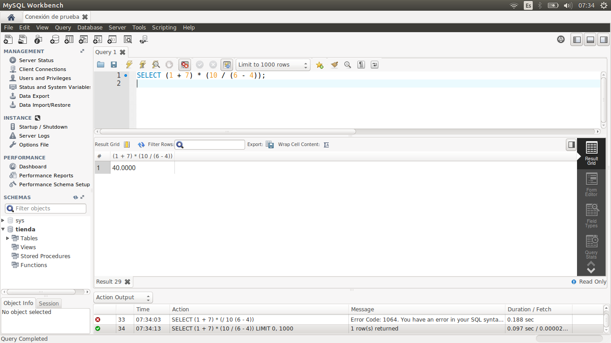
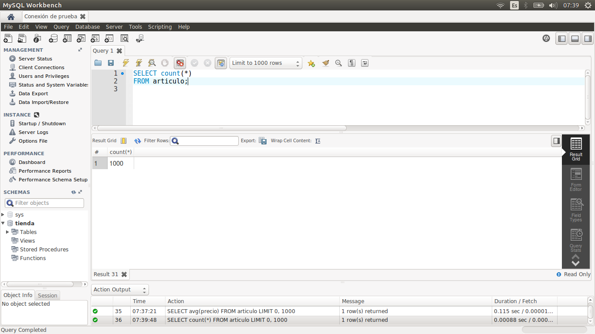
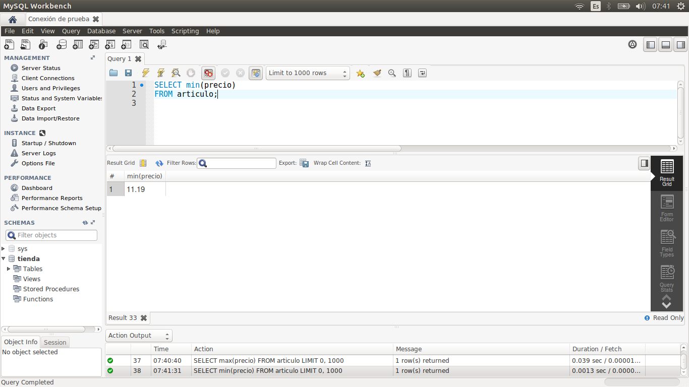
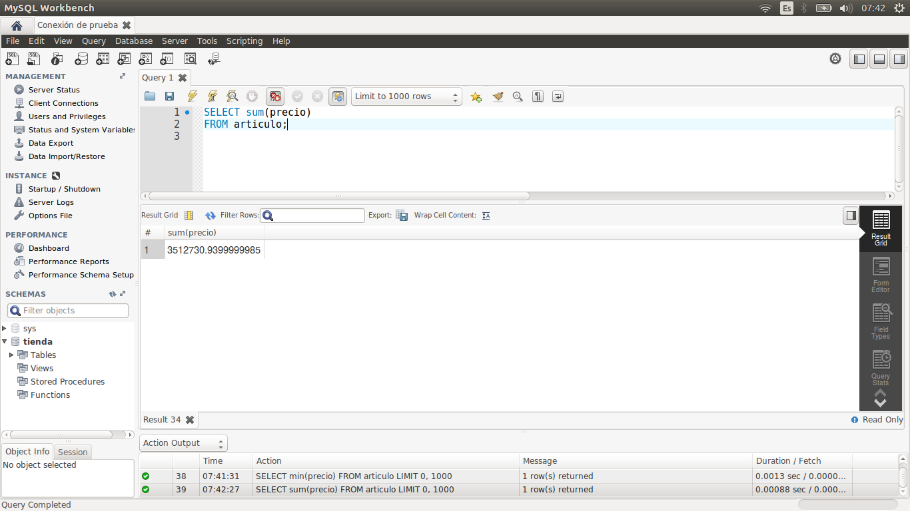

[`Introducción a Bases de Datos`](../../Readme.md) > [`Sesión 02`](../Readme.md) > `Ejemplo 2`

## Ejemplo 2: Funciones de agrupamiento

<div style="text-align: justify;">

### 1. Objetivos :dart:

- Realizar consultas que agrupen el valor de una columna mediante lo que se conoce como *función de agrupamiento*.

### 2. Requisitos :clipboard:

1. MySQL Workbench instalado.

### 3. Desarrollo :rocket:

1. Abre MySQL Wokbench y conectate a la base de datos del curso.

2. Ahora revisaremos algunas de las principales funciones de agrupamiento existentes en MySQL. Nos enfocaremos en funciones aritméticas pues son las más usadas, sin embargo, si estás interesado en conocer funciones de otros tipos de datos, te recomendamos que visites esta [liga](https://www.techonthenet.com/mysql/functions/).

   Antes de iniciar con las funciones de agrupamiento, es importante saber que se tienen distintos operadores aritméticos, tales como sumas, restas, multiplicaciones y divisiones. Para ejemplificarlos haremos una consulta sin tabla, es decir, sin la cláusula `FROM`.

   ```sql
   SELECT (1 + 7) * (10 / (6 - 4));
   ```
   
   

3. Una función de agrupamiento es aquella que reduce los registros de un campo en un valor. Veamos algunos ejemplos de este tipo de funciones.

   *Promedio de una columna*

   ```sql
   SELECT avg(precio)
   FROM articulo;
   ```

   
   
   *Número de registros de una columna*

   ```sql
   SELECT count(*)
   FROM articulo;
   ```

   
   
   *Valor máximo de una columna*

   ```sql
   SELECT max(precio)
   FROM articulo;
   ```

   
   
   *Valor mínimo de una columna*

   ```sql
   SELECT min(precio)
   FROM articulo;
   ```

      

   *Suma de una columna*

   ```sql
   SELECT sum(precio)
   FROM articulo;
   ```

   

[`Anterior`](../Readme.md#funciones-de-agrupamiento) | [`Siguiente`](../Reto-02/Readme.md)      

</div>
