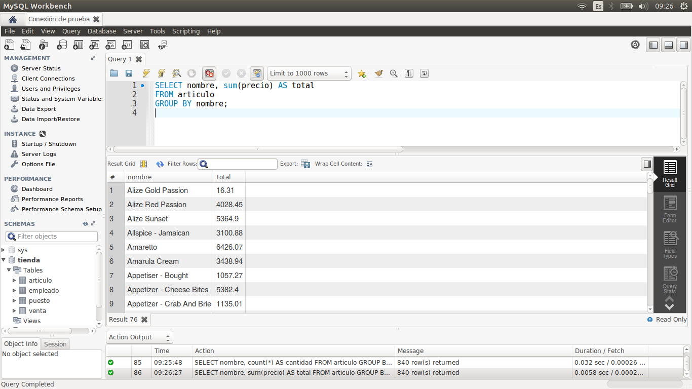
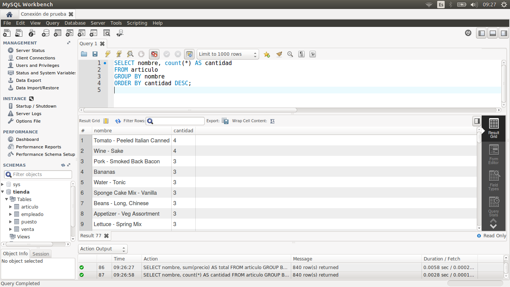

[`Introducción a Bases de Datos`](../../Readme.md) > [`Sesión 02`](../Readme.md) > `Ejemplo 3`

## Ejemplo 3: Agrupamientos

<div style="text-align: justify;">

### 1. Objetivos :dart:

- Escribir consultas que hagan uso de agrupamientos mediante las funciones revisadas en el Ejemplo 2.

### 2. Requisitos :clipboard:

1. MySQL Workbench instalado.

### 3. Desarrollo :rocket:

1. Abre MySQL Wokbench y conectate a la base de datos del curso.

2. Ahora revisaremos el concepto de agrupamiento. Para hacer un agrupamiento se usa la cláusula `GROUP BY` que recolecta datos de múltiples registros y los agrupa en una o más columnas. Veamos algunos ejemplos.

   *Usando `SUM`*
   
   Se añade un *alias* a la consulta para hacer más entendible el nombre de la columna. Para añadir un alias se debe usar la primitiva `AS`. Recuerda que los campos antes de las funciones de agregación son los que deben aparecer en la cláusula `GROUP BY`.

   ```sql
   SELECT nombre, sum(precio) AS total
   FROM articulo
   GROUP BY nombre;
   ```
   
   
   
   *Usando `COUNT`*

   ```sql
   SELECT nombre, count(*) AS cantidad
   FROM articulo
   GROUP BY nombre
   ORDER BY cantidad DESC;
   ```
   
   
   
   *Usando `MIN` y `MAX`*
   
   ```sql
   SELECT nombre, min(salario) AS menor, max(salario) AS mayor
   FROM puesto
   GROUP BY nombre;
   ```

   

[`Anterior`](../Readme.md#agrupamientos) | [`Siguiente`](../Reto-03/Readme.md)         

</div>   
