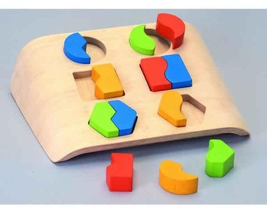
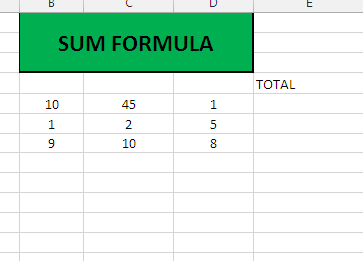

[`Introducción a Bases de Datos`](../README.md) > `Sesión 2`

## Sesión 2: Agrupaciones y subconsultas


<div style="text-align: justify;">

### 1. Objetivos :dart: 

- Escribir consultas que hagan uso de `LIKE`.
- Entender el funcionamiento de algunas funciones y su efecto en consultas.
- Realizar agrupamientos en los resultados de una consulta o tabla.
- Realizar subconsultas a una tabla.

### 2. Contenido :blue_book:

---

#### <ins>Búsqueda de patrones mediante `LIKE`</ins>
 

La *búsqueda de patrones* es una técnica que permite realizar búsquedas mediante la coincidencia de patrones en lugar de igualdad. Ejemplos de uso de esta técnica son:  
* Las expresiones regulares  
* El uso de la cláusula `LIKE` en __SQL__  

> *Describir a profundidad la técnica de pattern matching y mencionar lenguajes de programación u otras herramientas tecnológicas que utilicen esta técnica.*

> *Explicar qué son las expresiones regulares.*

##### Cláusula `LIKE`
La cláusula `LIKE` permite usar comodines en la cláusula `WHERE` de una instrucción `SELECT` y realizar búsqueda de patrones.  


> *Describir la sintaxis de LIKE y los comodines existentes. Se recomienda hacerlo de manera visual en el pizarrón.*

- [**`EJEMPLO 1`**](Ejemplo-01/Readme.md)
- [**`RETO 1`**](Reto-01/Readme.md)	

---

#### <ins>Funciones de agrupamiento</ins>
 

Las funciones de agrupamiento son funciones que permiten realizar cálculos sobre los valores de una columna y que regresan un único valor.  
 
```
SUM()  
AVG()  
MAX()  
MIN()  
COUNT()
```


> *Explicar cómo funciona una función de agrupamiento y ejemplificar, relacionarlo con el comportamiento que tienen las hojas de cálculo (Excel).*

- [**`EJEMPLO 2`**](Ejemplo-02/Readme.md)
- [**`RETO 2`**](Reto-02/Readme.md)	

---

#### <ins>Agrupamientos</ins>
 

La cláusula `GROUP BY` es usada dentro de la instrucción `SELECT` para recolectar datos a partir de varios registros y agruparlos en una o más columnas.

> *Explicar el uso de agrupamientos de bases de datos, quizá mencionar alguno de sus principales usos. Nuevamente se sugiere hacer dibujos en el pizarrón para hacer más claro el resultado (antes del ejemplo).*

- [**`EJEMPLO 3`**](Ejemplo-03/Readme.md)
- [**`RETO 3`**](Reto-03/Readme.md)	

---

#### <ins>Subconsultas</ins>


Una subconsulta es una consulta que se encuentra dentro de otra. Estas subconsultas pueden aparecer en las cláusulas, `WHERE`, `FROM` y en el área de campos de SELECT.  

> *Explicar qué es una subconsulta, en qué consiste, y cómo se puede usar en un `WHERE`, `FROM` y `SELECT`.*

- [**`EJEMPLO 4`**](Ejemplo-04/Readme.md)
- [**`RETO 4`**](Reto-04/Readme.md)	

---

### 3. Ejercicios para practicar :hammer:

Aplica lo todo lo que aprendiste durante la sesión en este proyecto. 

- [**`EJERCICIOS SESIÓN 2`**](Ejercicios/Readme.md)

</br>

[`Anterior`](../Sesion-01/Readme.md) | [`Siguiente`](../Sesion-03/Readme.md)

</div>
