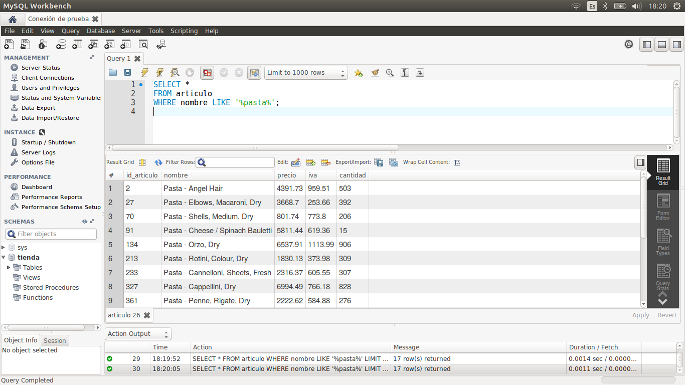
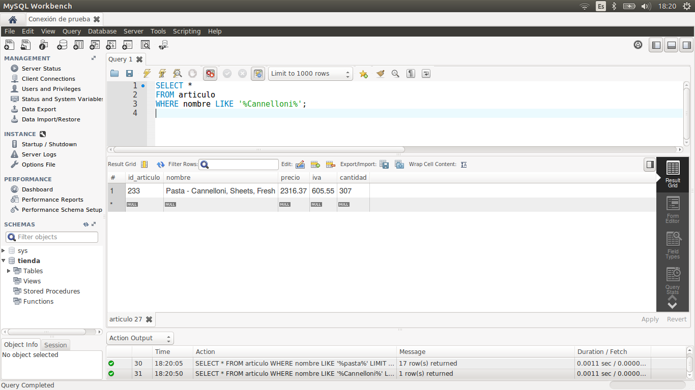
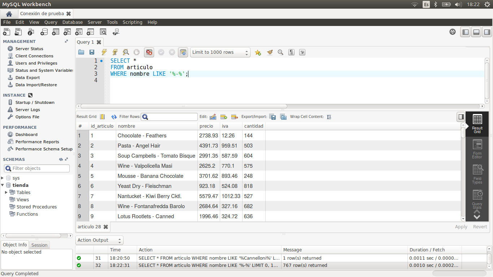

[`Introducción a Bases de Datos`](../../Readme.md) > [`Sesión 02`](../Readme.md) > `Reto 1`
	
## Reto 1: Búsqueda de patrones mediante LIKE

<div style="text-align: justify;">

### 1. Objetivos :dart:

- Escribir consultas que permitan responder a algunas preguntas.

### 2. Requisitos :clipboard:

1. MySQL Workbench instalado.

### 3. Desarrollo :rocket:

Usando la base de datos `tienda`, escribe consultas que permitan responder las siguientes preguntas.

- ¿Qué artículos incluyen la palabra `Pasta` en su nombre?
- ¿Qué artículos incluyen la palabra `Cannelloni` en su nombre?
- ¿Qué nombres están separados por un guión (`-`) por ejemplo `Puree - Kiwi`?
- ¿Qué puestos incluyen la palabra `Designer`?
- ¿Qué puestos incluyen la palabra `Developer`?

<details><summary>Solución</summary>
<p>

- ¿Qué artículos incluyen la palabra `Pasta` en su nombre?

   ```sql
   SELECT *
   FROM articulo
   WHERE nombre LIKE '%PASTA%';
   ```
   

- ¿Qué artículos incluyen la palabra `Cannelloni` en su nombre?

   ```sql
   SELECT *
   FROM articulo
   WHERE nombre LIKE '%Cannelloni%';
   ```
   
   
- ¿Qué nombres están separados por un guión (`-`) por ejemplo `Puree - Kiwi`?

   ```sql
   SELECT *
   FROM articulo
   WHERE nombre LIKE '% - %';
   ```
    
    
- ¿Qué puestos incluyen la palabra `Designer`?
    
   ```sql
   SELECT *
   FROM puesto 
   WHERE nombre LIKE "%Designer%";
   ```
    
- ¿Qué puestos incluyen la palabra `Developer`?
    
   ```sql
   SELECT *
   FROM puesto 
   WHERE nombre LIKE "%Developer%";
   ```

</p>
</details>

<br/>

[`Anterior`](../Ejemplo-01/Readme.md) | [`Siguiente`](../Readme.md#funciones-de-agrupamiento)   


</div>
