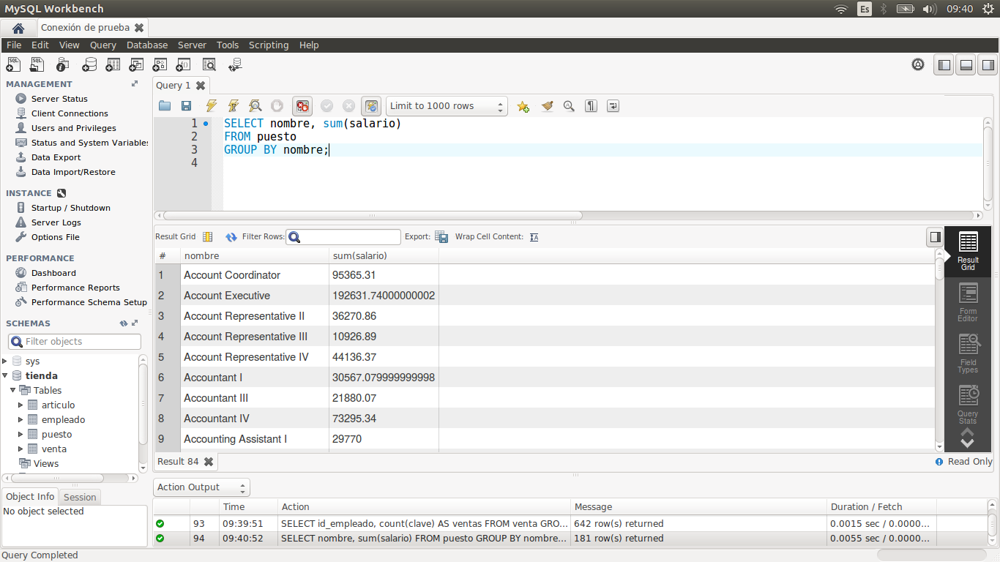
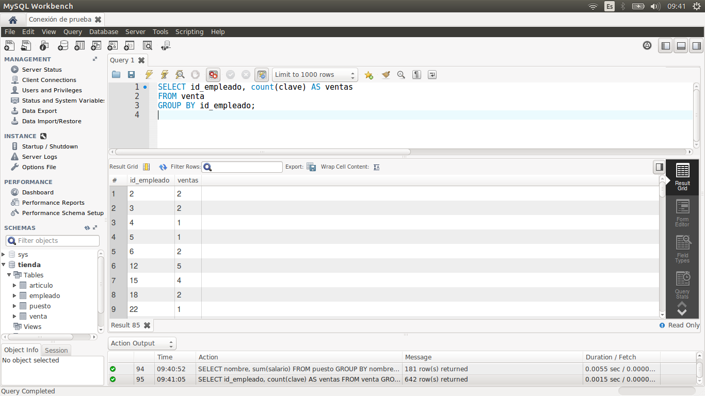
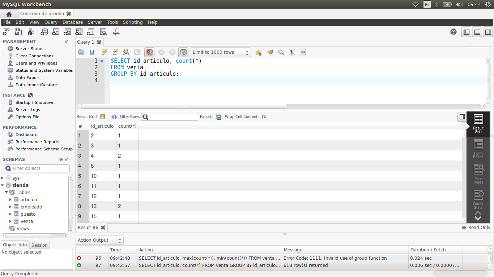

[`Introducción a Bases de Datos`](../../Readme.md) > [`Sesión 02`](../Readme.md) > `Reto 3`
	
## Reto 3: Agrupamientos

<div style="text-align: justify;">

### 1. Objetivos :dart:

- Escribir consultas que permitan responder a algunas preguntas.

### 2. Requisitos :clipboard:

1. MySQL Workbench instalado.

### 3. Desarrollo :rocket:

Usando la base de datos `tienda`, escribe consultas que permitan responder las siguientes preguntas.

- ¿Cuántos registros hay por cada uno de los puestos?
- ¿Cuánto dinero se paga en total por puesto?
- ¿Cuál es el número total de ventas por vendedor?
- ¿Cuál es el número total de ventas por artículo?

<details><summary>Solución</summary>
<p>

- ¿Cuántos registros hay por cada uno de los puestos?

   ```sql
   SELECT nombre, count(*)
   FROM puesto
   GROUP BY nombre;
   ```
   

- ¿Cuánto dinero se paga en total por puesto?

   ```sql
   SELECT nombre, sum(salario)
   FROM puesto
   GROUP BY nombre;
   ```
   
   
- ¿Cuál es el número total de ventas por vendedor?

   ```sql
   SELECT id_empleado, count(clave) AS ventas
   FROM venta
   GROUP BY id_empleado;
   ```
   
   
- ¿Cuál es el número total de ventas por artículo?
   
   ```sql
   SELECT id_articulo, count(*)
   FROM venta
   GROUP BY id_articulo;
   ```
   
   

</p>
</details> 

<br/>

[`Anterior`](../Ejemplo-03/Readme.md) | [`Siguiente`](../Readme.md#subconsultas)         

</div>
