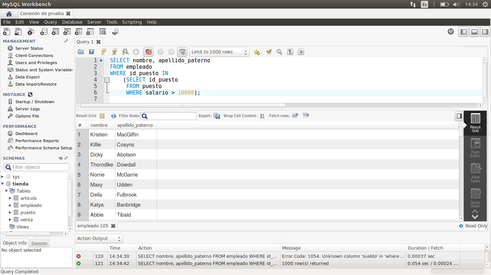
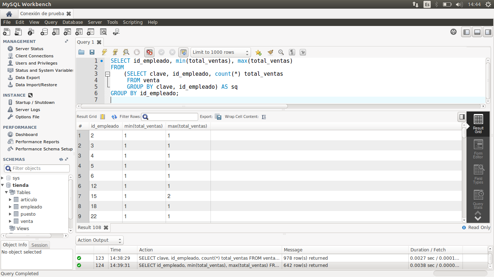
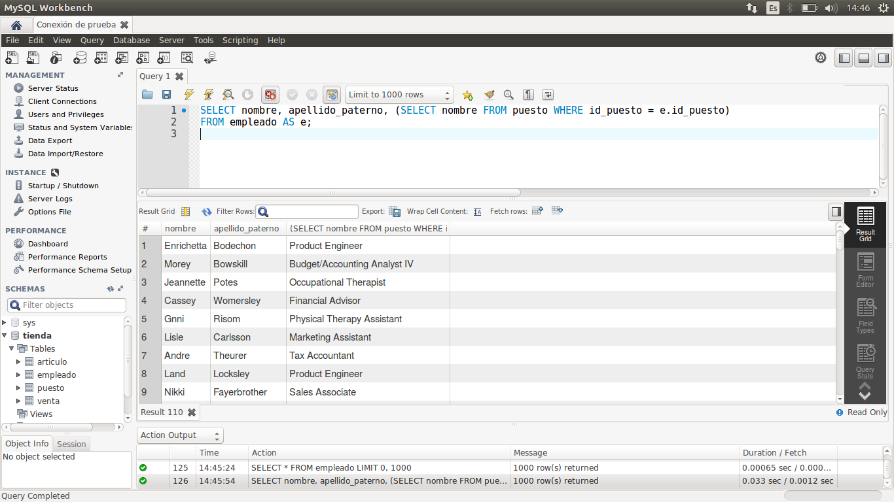

[`Introducción a Bases de Datos`](../../Readme.md) > [`Sesión 02`](../Readme.md) > `Reto 4`
	
## Reto 4: Subconsultas

<div style="text-align: justify;">

### 1. Objetivos :dart:

- Escribir consultas que permitan responder a algunas preguntas.

### 2. Requisitos :clipboard:

1. MySQL Workbench instalado.

### 3. Desarrollo :rocket:

Usando la base de datos `tienda`, escribe consultas que permitan responder las siguientes preguntas.

- ¿Cuál es el nombre de los empleados cuyo sueldo es menor a $10,000?
- ¿Cuál es la cantidad mínima y máxima de ventas de cada empleado?
- ¿Cuál es el nombre del puesto de cada empleado?

<details><summary>Solución</summary>
<p>

- ¿Cuál es el nombre de los empleados cuyo sueldo es menor a $10,000?

   ```sql
   SELECT nombre, apellido_paterno
   FROM empleado
   WHERE id_puesto IN
	(SELECT id_puesto
         FROM puesto
         WHERE salario > 10000);
   ```
   
   

- ¿Cuál es la cantidad mínima y máxima de ventas de cada empleado?

   ```sql
   SELECT id_empleado, min(total_ventas), max(total_ventas)
   FROM
	(SELECT clave, id_empleado, count(*) total_ventas
         FROM venta
         GROUP BY clave, id_empleado) AS sq
   GROUP BY id_empleado;
   ```
   
   
   
- ¿Cuál es el nombre del puesto de cada empleado?

   ```sql
   SELECT nombre, apellido_paterno, (SELECT nombre FROM puesto WHERE id_puesto = e.id_puesto)
   FROM empleado AS e;
   ```
   
</p>
</details> 

<br/>

[`Anterior`](../Ejemplo-04/Readme.md) | [`Siguiente`](../Readme.md#3-proyecto-hammer)            

</div>
