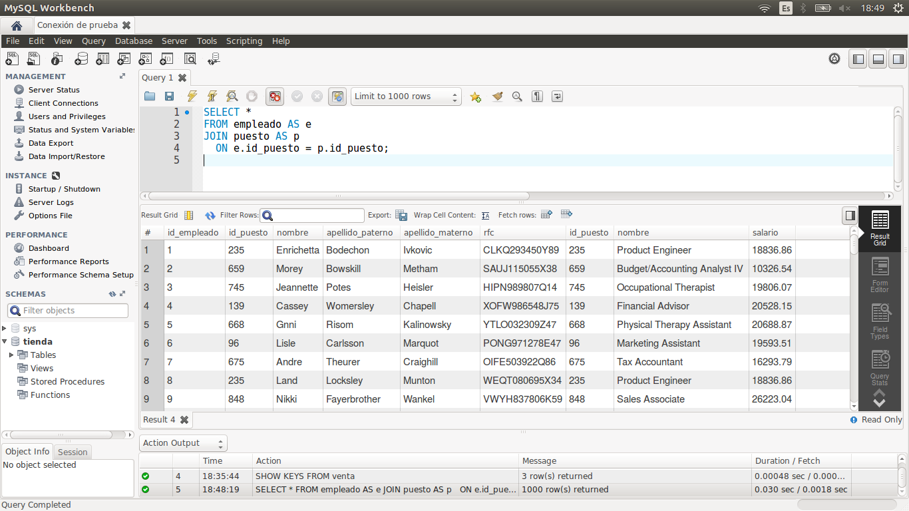
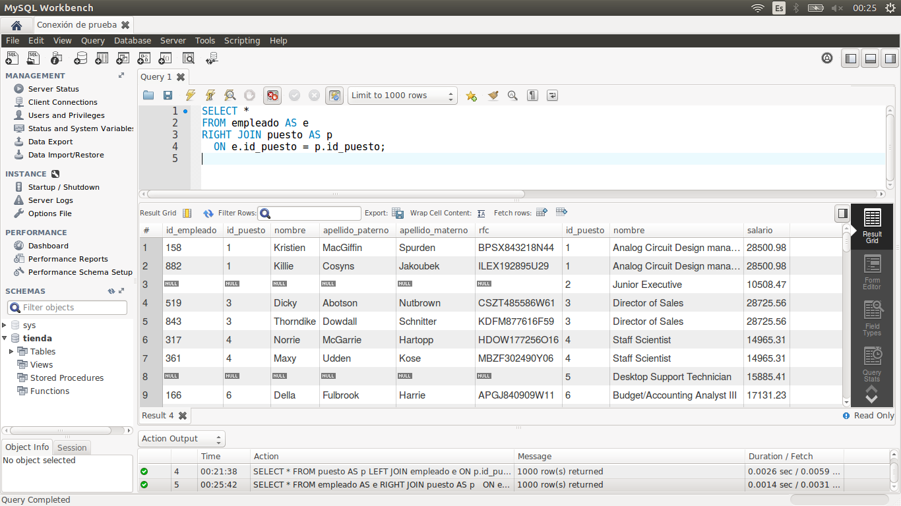

[`Introducción a Bases de Datos`](../../Readme.md) > [`Sesión 03`](../Readme.md) > `Ejemplo 1`

## Ejemplo 1: Clasificación de Joins

<div style="text-align: justify;">

### 1. Objetivos :dart:

- Analizar la relación que existe entre dos o más tablas.
- Comprender las distintas formas de relacionar tablas mediante el uso de las cláusulas `JOIN`, `LEFT JOIN` y `RIGHT JOIN`.

### 2. Requisitos :clipboard:

1. MySQL Workbench instalado.

### 3. Desarrollo :rocket:

1. Abre MySQL Wokbench y conectate a la base de datos `tienda`.

2. Para poder relacionar tablas, necesitamos conocer las *llaves primarias* y *foráneas* presentes en una tabla. Una forma de encontrar esto es usando la primitiva `SHOW KEYS`. Por ejemplo, a continuación se muestran las llaves para la tabla `venta` del esquema `tienda`.

   ```sql
   SHOW KEYS FROM venta;
   ```
   
   
   
   La llave primaria se resalta pues en el campo `Key_name` aparece el valor `PRIMARY`, mientras que el resto de las llaves se consideran llaves foráneas.
   
3. Los joins son usados para obtener información de varias tablas. Para obtener esta información, existen tres variantes de join: por la izquierda, por la derecha y el join simple.

   *`JOIN`/`INNER JOIN`*
   
   Es el tipo de join más común y regresa todos los registros de múltiples tablas donde se cumplan la condición del join (*join codition*). Por ejemplo, podemos relacionar la tabla `empleado` con `puesto`.
   
   ```sql
   SELECT *
   FROM empleado AS e
   JOIN puesto AS p
     ON e.id_puesto = p.id_puesto;
   ```

   
   
   *`LEFT JOIN` / `LEFT OUTER JOIN`*  
   
   Este tipo join, regresa todos los registros de la tabla izquierda que se está relacionando y únicamente aquellos que cumplen con la condición de relación de la tabla derecha. Si algún registro no cumple con la condición, llenará sus campos con `NULL`.
 
   ```sql
   SELECT *
   FROM puesto AS p
   LEFT JOIN empleado e
   ON p.id_puesto = e.id_puesto;
   ```
   
   
   
   *`RIGHT JOIN` / `RIGHT OUTER JOIN`*
   
   Este tipo de join, es equivalente al anterior. Regresa todos los registros de la tabla derecha que se está relacionando y únicamente aquellos que cumplen con la condición de relación de la tabla izquierda. Si algún registro no cumple con la condición, llenará sus campos con `NULL`.
   
   ```sql
   SELECT *
   FROM empleado AS e
   RIGHT JOIN puesto AS p
   ON e.id_puesto = p.id_puesto;
   ```
   
   

[`Anterior`](../Readme.md#clasificación-de-joins) | [`Siguiente`](../Reto-01/Readme.md)

</div>
