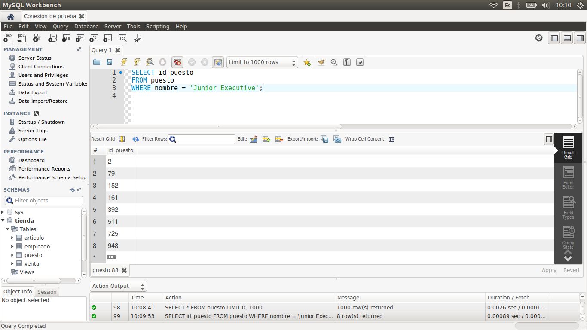
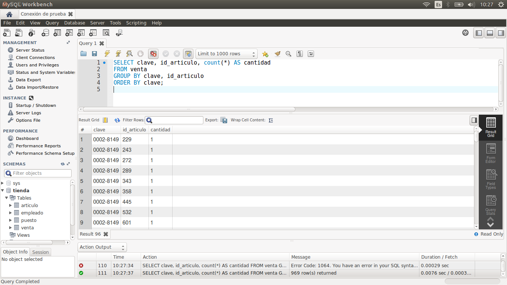

[`Introducción a Bases de Datos`](../../Readme.md) > [`Sesión 02`](../Readme.md) > `Ejemplo 1`

## Ejemplo 1: Subconsultas

<div style="text-align: justify;">

### 1. Objetivos :dart:

- Escribir consultas que hagan uso de otras subconsultas, ya sea en la cláusula `SELECT`, en la cláusula `FROM` o en la cláusula `WHERE`.

### 2. Requisitos :clipboard:

1. MySQL Workbench instalado.

### 3. Desarrollo :rocket:

1. Abre MySQL Wokbench y conectate a la base de datos del curso.

2. Una subconsulta es una consulta dentro de otra. Puede crear sunconsultas en SQL y pueden aparecer en la cláusula `WHERE`, `FROM` o `SELECT`. Veamos algunos ejemplos.
    
   *Usando `WHERE` + `>`*
    
   ¿Cuál es la suma del salario de los últimos cinco puestos agregados?

   Primero obtenemos el ídentificador que nos permite saber eso.
   
   ```sql
   SELECT max(id_puesto) - 5
   FROM puesto;
   ```  
  
Usamos ese identificador ahora.

    
   ```sql
   SELECT sum(salario)
   FROM puesto
   WHERE id_puesto > 995;
   ```  
  
Usando una subconsulta lo podríamos hacer de la siguiente manera:
    
   ```sql
   SELECT sum(salario)
   FROM puesto
   WHERE id_puesto > (SELECT max(id_puesto) - 5 FROM puesto);
   ```  
  
   *Usando `WHERE` + `IN`*
   
   Queremos los empleados cuyo puesto es `Junior Executive`. Para realizar la subconsulta, descompongamos el problema en partes. Primero necesitamos saber el identificador de los puestos con ese nombre.

   ```sql
   SELECT id_puesto
   FROM puesto
   WHERE nombre = 'Junior Executive';
   ```
   
   
   
   Ahora, con los identificadores que obtuvimos, podemos hacer una búsqueda de los empleado que tienen dichos identificadores. Para ello, usamos la consulta anterior dentro de la cláusula `WHERE` y filtramos aquellos empleados cuyo `id_puesto` esté en los resultados de la misma.
   
   ```sql
   SELECT *
   FROM empleado
   WHERE id_puesto IN 
      (SELECT id_puesto
      FROM puesto
      WHERE nombre = 'Junior Executive');
   ```
   
   
   
   *Usando `FROM`*
   
   Ahora queremos saber cuál es la menor y mayor cantidad de ventas de un artículo. Nuevamente, volvemos a descomponer el problema. Primero, obtengamos la cantidad de piezas por venta de un artículo. 

   ```sql
   SELECT clave, id_articulo, count(*) AS cantidad
   FROM venta
   GROUP BY clave, id_articulo
   ORDER BY clave;
   ```
   
   
   
   Ahora, sobre la tabla resultante hacemos un nuevo agrupamiento para obtener la cantidad mínima y máxima de cada artículo, sin importar la venta.
   
   ```sql
   SELECT id_articulo, min(cantidad), max(cantidad)
   FROM 
      (SELECT clave, id_articulo, count(*) AS cantidad
      FROM venta
      GROUP BY clave, id_articulo
      ORDER BY clave) AS subconsulta
   GROUP BY id_articulo;
   ```
   
   


[`Anterior`](../Readme.md#subconsultas) | [`Siguiente`](../Reto-01/Readme.md)            

</div>
