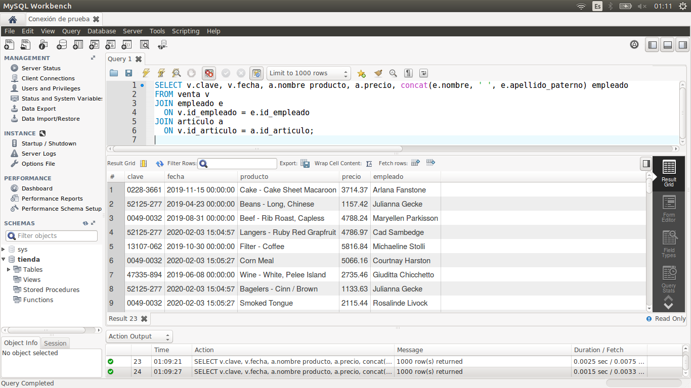
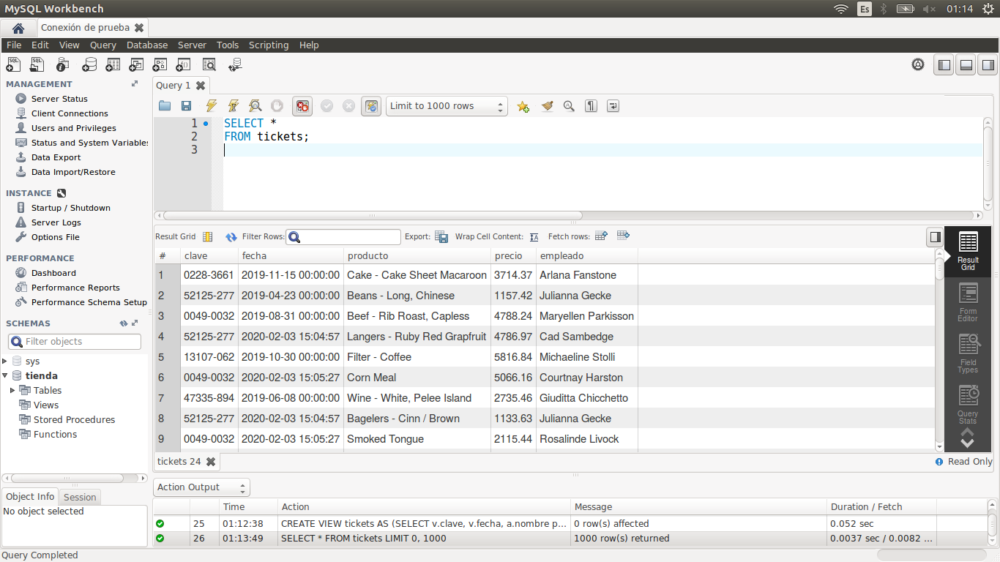
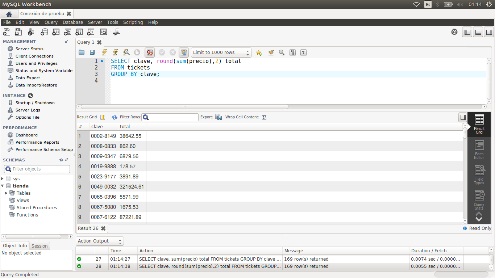

[`Introducción a Bases de Datos`](../../Readme.md) > [`Sesión 03`](../Readme.md) > `Ejemplo 2`

## Ejemplo 2: Definición de vistas

<div style="text-align: justify;">

### 1. Objetivos :dart:

- Crear vistas para preservar el contenido de una consulta.
- Consultas vistas como cualquier otra tabla.

### 2. Requisitos :clipboard:

1. MySQL Workbench instalado.

### 3. Desarrollo :rocket:

---

 

:warning: <ins>**IMPORTANTE**</ins>

_Para este ejemplo y los siguientes retos necesitarás un identificador único. Tu identificador serán los últimos tres dígitos de tu número de celular. Por ejemplo, si tu número es: 5512345678 tu identificador debe ser 678. <ins>¡No lo olvides!</ins>_   

_**Te pedimos esto para que todos puedan realizar los ejemplos.**_


_Si no sigues las instruciones..._   

---

1. Abre MySQL Wokbench y conectate a la base de datos tienda `tienda`.

2. Una vista permite preservar los resultados obtenidos mediante una consulta. Esto es útil pues no se tienen que estar reescribiendo relaciones, agrupando resultado, ordenando los registros, etc. La vista se almacena en memoria como si fuera una tabla cualquiera. 

   Por ejemplo, la tabla que almacena las ventas, puede relacionarse con los empleados y los artículo. Podemos crear una vista que almacene esta relación como si fuera un *ticket*.
   
   Lo primero será, definir la consulta.

   ```sql
   SELECT v.clave, v.fecha, a.nombre producto, a.precio, concat(e.nombre, ' ', e.apellido_paterno) empleado 
   FROM venta v
   JOIN empleado e
     ON v.id_empleado = e.id_empleado
   JOIN articulo a
     ON v.id_articulo = a.id_articulo;
   ```
   
   
   
   Ahora crearemos la vista con la instrucción `CREATE VIEW`. Le daremos el nombre `tickets_<tu identificador>`. Por ejemplo, si tu identificador es `678`, debes crear la vista `tickets_678`.
    
   ```sql
   CREATE VIEW tickets_678 AS
   (SELECT v.clave, v.fecha, a.nombre producto, a.precio, concat(e.nombre, ' ', e.apellido_paterno) empleado 
   FROM venta v
   JOIN empleado e
     ON v.id_empleado = e.id_empleado
   JOIN articulo a
     ON v.id_articulo = a.id_articulo);
   ```
   
3. Ahora que se ha creado la vista, pueden realizarse consultas sobre la misma al igual que con cualquier tabla.

   ```sql
   SELECT *
   FROM tickets_678;
   ```

   
 
   ```sql
   SELECT clave, round(sum(precio),2) total
   FROM tickets_678
   GROUP BY clave;	
   ```
   
   

[`Anterior`](../Readme.md#definición-de-vistas) | [`Siguiente`](../Reto-02/Readme.md)

</div>   
