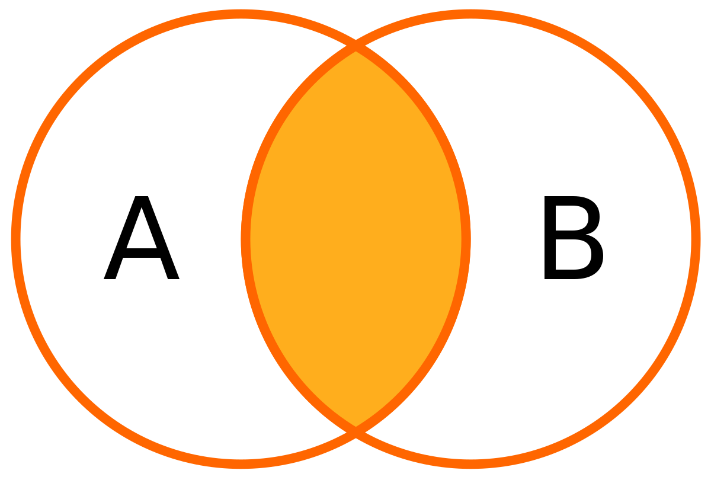

[`Introducción a Bases de Datos`](../Readme.md) > `Sesión 3`

## Sesión 3: Subconsultas, Joins y Vistas

### 1. Objetivos :dart: 

- Aprender a enlazar dos o más consultas a través de subconsultas.
- Escribir consultas que relacionen dos o más tablas mediante el uso de joins.
- Definir vistas que guarden el resultado de una consulta.

### 2. Contenido :blue_book:

---

#### <ins>Subconsultas</ins>

Una subconsulta es una consulta que se encuentra dentro de otra. Estas subconsultas pueden aparecer en las cláusulas, WHERE, FROM y en el área de campos de SELECT.  

> Explicar qué es una subconsulta, en qué consiste, y cómo se puede usar en un WHERE, FROM y SELECT.

- [**`EJEMPLO 1`**](Ejemplo-01/Readme.md)
- [**`RETO 1`**](Reto-01/Readme.md)	
    
---
    
#### <ins>Clasificación de *joins*</ins>
 

Para relacionar tablas se incluyen los *joins* que son operadores entre tablas, las cuales permiten asociar dos o más tablas mediane sus campos. Por lo general, esta asociacion se realiza usando las llaves primarias y foráneas de cada tabla. Los tipos de *join* que incluye __MySQL__ son:

1. `INNER JOIN`
1. `LEFT OUTER JOIN`
1. `RIGHT OUTER JOIN`

> *Explicar el concepto de join y las direntes entre cada una de sus variables. Se sugiere <ins>ampliamente</ins> el uso del pizarrón para ejemplificar los resultados después de aplicar estas operaciones.*

- [**`EJEMPLO 2`**](Ejemplo-02/Readme.md)
- [**`RETO 2`**](Reto-02/Readme.md)	

---

#### <ins>Definición de vistas</ins>
 

Una vista es una tabla *virtual* que almacena los resultados de una consulta. Son útiles cuando las consultas son demasiado complejas y su proceso puede tomar varios minutos en ejecutarse. De esta forma, se consultan directamente los resultados de la consulta como si se tratara de cualquier tabla.

Para crear una vista se usa:

`CREATE VIEW`

Las vistas no requieren de almacenamiento adicional y pueden consultar usando la cláusula `SELECT`.

> *Explicar el concepto de vista y sus principales ventajas.*

- [**`EJEMPLO 3`**](Ejemplo-03/Readme.md)
- [**`RETO 3`**](Reto-03/Readme.md)	

---

### 3. Ejercicios de práctica :hammer:

Aplica lo todo lo que aprendiste durante la sesión en estos ejercicios. 

- [**`EJERCICIOS SESIÓN 3`**](Ejercicios/Readme.md)

 

[`Anterior`](../Sesion-02/Readme.md) | [`Siguiente`](../Sesion-04/Readme.md)

	
