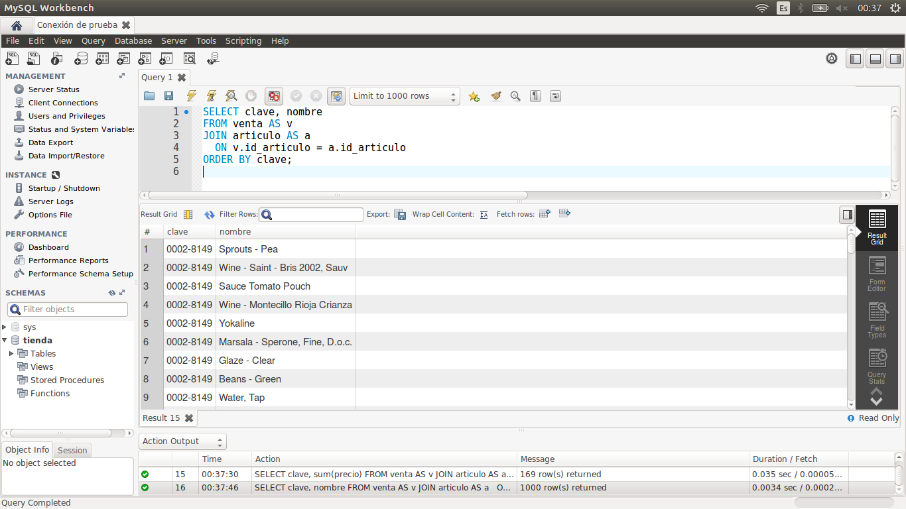

[`Introducción a Bases de Datos`](../../Readme.md) > [`Sesión 03`](../Readme.md) > `Reto 2`
	
## Reto 2: Joins

<div style="text-align: justify;">

### 1. Objetivos :dart:

- Escribir consultas que permitan responder a algunas preguntas.

### 2. Requisitos :clipboard:

1. MySQL Workbench instalado.

### 3. Desarrollo :rocket:

Usando la base de datos `tienda`, escribe consultas que permitan responder las siguientes preguntas.

- ¿Cuál es el nombre de los empleados que realizaron cada venta?
- ¿Cuál es el nombre de los artículos que se han vendido?
- ¿Cuál es el total de cada venta?

<details><summary>Solución</summary>
<p>

- ¿Cuál es el nombre de los empleados que realizaron cada venta?

   ```sql
   SELECT clave, nombre, apellido_paterno
   FROM venta AS v
   JOIN empleado AS e
     ON v.id_empleado = e.id_empleado
   ORDER BY clave;
   ```
   
   

- ¿Cuál es el nombre de los artículos que se han vendido?

   ```sql
   SELECT clave, nombre
   FROM venta AS v
   JOIN articulo AS a
     ON v.id_articulo = a.id_articulo
   ORDER BY clave;
   ```
   
   
   
- ¿Cuál es el total de cada venta?

   ```sql
   SELECT clave, round(sum(precio),2) AS total
   FROM venta AS v
   JOIN articulo AS a
     ON v.id_articulo = a.id_articulo
   GROUP BY clave
   ORDER BY clave;
   ```
    

</p>
</details> 

<br/>

[`Anterior`](../Ejemplo-01/Readme.md) | [`Siguiente`](../Readme.md#definición-de-vistas)

</div>
