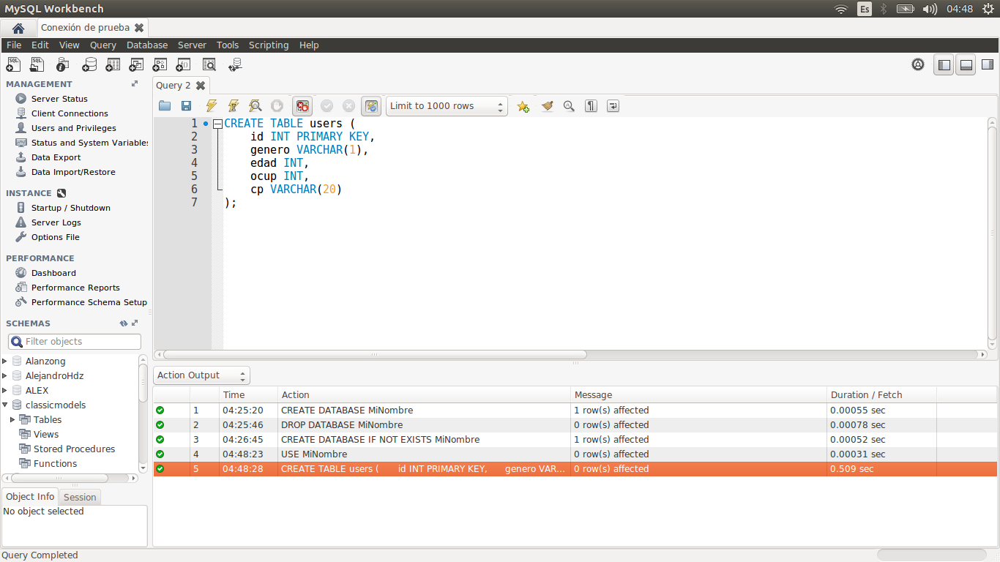
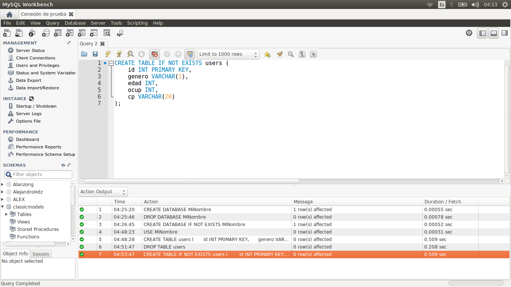

[`Introducción a Bases de Datos`](../../Readme.md) > [`Sesión 04`](../Readme.md) > Ejemplo 2

## Ejemplo 2: Realizando operaciones con tablas

### 1. Objetivos :dart:
 - Conocer las operaciones SQL para administrar tablas
 - Crear una tabla acorde a los datos

### 2. Requisitos :clipboard:
- Servidor __MySQL__ instalado

### 3. Desarrollo :rocket:

1. Comenzaremos descargando un conjunto de datos para ilustrar el proceso de carga de archivos. El archivo se ecuentra [aquí](http://files.grouplens.org/datasets/movielens/ml-1m.zip). Descarga el archivo y extraelo en tu computadora. 

1. Antes de crear una tabla, primero se revisará la estructura de los datos y la documentación para el archivo `users.dat`

   Primero revisamos el contenido del archivo. Puedes abrirlo en un editor de textos como __Notepad__ o incluso en el __Bloc de notas__.

   ```
   1::F::1::10::48067
   2::M::56::16::70072
   3::M::25::15::55117
   4::M::45::7::02460
   5::M::25::20::55455
   6::F::50::9::55117
   7::M::35::1::06810
   8::M::25::12::11413
   9::M::25::17::61614
   10::F::35::1::95370
   ...
   ```

   Y luego se revisa la documentación, dentro del archivo `README`, igual abriendolo con un editor de textos.

   ```
   USERS FILE DESCRIPTION
   ================================================================================

   User information is in the file "users.dat" and is in the following
   format:

   UserID::Gender::Age::Occupation::Zip-code

   All demographic information is provided voluntarily by the users and is
   not checked for accuracy.  Only users who have provided some demographic
   information are included in this data set.

   - Gender is denoted by a "M" for male and "F" for female
   - Age is chosen from the following ranges:

           *  1:  "Under 18"
           * 18:  "18-24"
           * 25:  "25-34"
           * 35:  "35-44"
           * 45:  "45-49"
           * 50:  "50-55"
           * 56:  "56+"

   ...
   ```

   Así que se definen los siguientes datos y tipo para crear la tabla `Users` en __MySQL__:
   - `id INT PRIMARY KEY`
   - `genero VARCHAR(1)`
   - `edad INT`
   - `ocup INT`
   - `cp VARCHAR(20)`

   El `id` será la llave primaria para la tabla, esto hay que indicarlo para que los valores sean únicos y además se crea un índice para acelerar las búsquedas.

   Para `edad` y `ocup` por el rango de datos que no va más allá de los 256 se podría usar el tipo `INT1` que es un entero que usa un sólo byte, pero esto es opcional.

   Para `cp` se ha definido una longitud de 20 porque se desconoce el tamaño máximo, esto se puede optimizar más adelante.   

1. Crear la tabla `users` (se ha usado el mismo nombre del archivo sin la extensión siempre y cuando no sea extremadamente largo) usando la instrucción __SQL__:

   ```sql
   CREATE TABLE users (
      id INT PRIMARY KEY, 
      genero VARCHAR(1), 
      edad INT,
      ocup INT,
      cp VARCHAR(20)
   );
   ```

   

   Recuerda que cada instrucción en __SQL__ termina siempre con punto y coma.s

   **Sugerencia.**  Cuando el comando `CREATE TABLE` sea usado con *scripts* para automatizar tareas, se sugiere usar la siguiente variante:

   ```sql
   CREATE TABLE IF NOT EXISTS nombre;
   ```

   para evitar que se marque un error en caso de que la tabla ya exista y se intente crear de nuevo.

1. Otra operación a realizar es el de eliminar una tabla, eso se hace con el comando `DROP TABLE nombre`.

   ```sql
   DROP TABLE users;
   ```

   Así que para eliminar la tabla `users` se ejecuta el comando:

   
   
   **Sugerencia.**  Cuando este comando sea usado con *scripts* para automatizar tareas, se sugiere usar la siguiente variante:
   
   ```sql
   DROP TABLE IF EXISTS nombre;
   ```

   para evitar que se marque un error en caso de que la tabla ya no exista y se intente borrar de nuevo.

   Si deseas, puedes validar que la tabla ya no exista con el comando `SHOW TABLES`.

1. Finalmente se crea nuevamente la tabla `users` y se valida que exista.

   ```sql
   CREATE TABLE IF NOT EXISTS users (
      id INT PRIMARY KEY, 
      genero VARCHAR(1), 
      edad INT,
      ocup INT,
      cp VARCHAR(20)
   );
   ```

   

[`Anterior`](../Readme.md#relacionado-operaciones-con-tablas) | [`Siguiente`](../Reto-01/Readme.md)   
