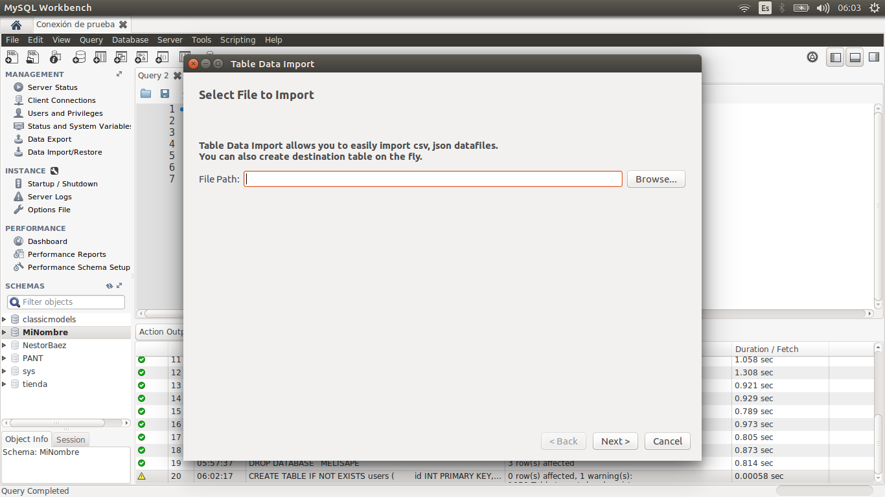
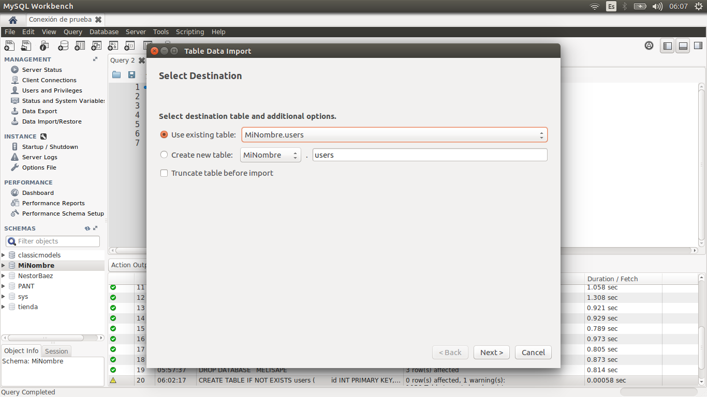
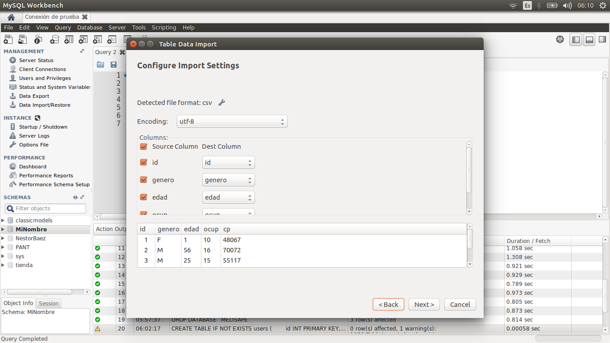
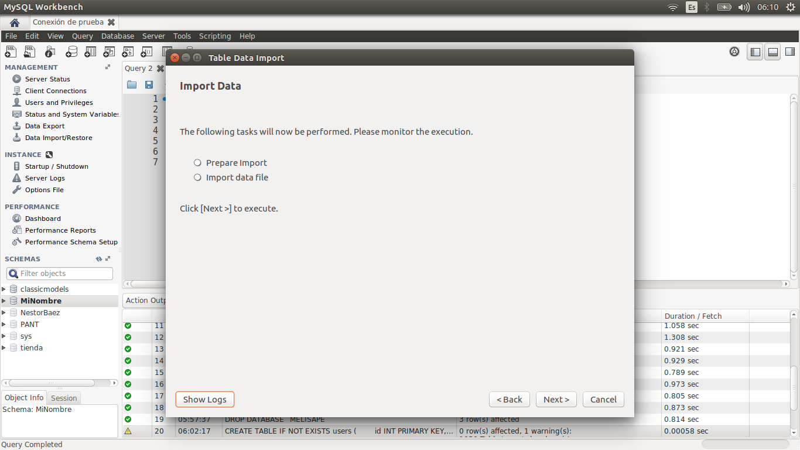
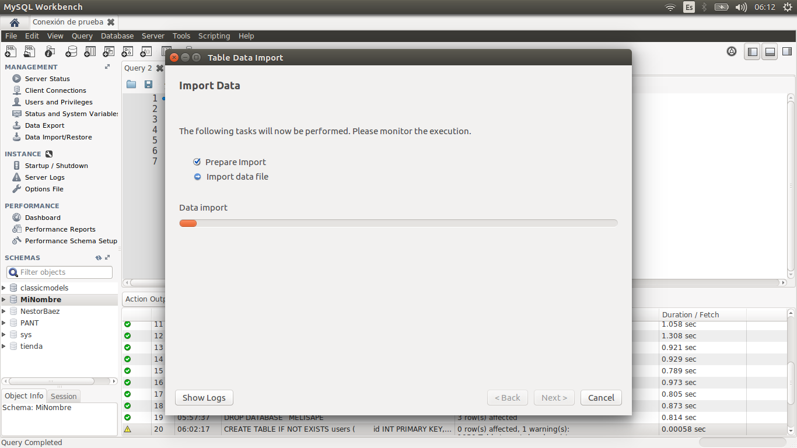
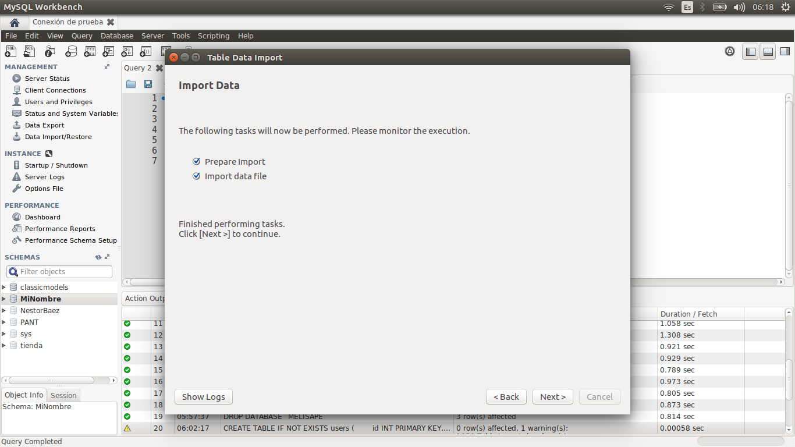

[`Introducción a Bases de Datos`](../../Readme.md) > [`Sesión 04`](../Readme.md) > Ejemplo 3

## Ejemplo 3: 	Importando datos a una tabla en formato CSV

### 1. Objetivos :dart:
 - Conocer el procedimiento para importación de datos a una tabla
 - Validar que la correcta importación de los datos

### 2. Requisitos :clipboard:
 - Servidor __MySQL__ instalado

### 3. Desarrollo :rocket:
1. Para cargar nuestros conjuntos de datos necesitamos que estén en un formato CSV. Como recordarás, el archivo `users.dat` tiene el siguiente formato:

   ```
   1::F::1::10::48067
   2::M::56::16::70072
   3::M::25::15::55117
   4::M::45::7::02460
   5::M::25::20::55455
   6::F::50::9::55117
   7::M::35::1::06810
   8::M::25::12::11413
   9::M::25::17::61614
   10::F::35::1::95370
   ...
   ``` 

   Para que sea un archivo CSV válido, éste debe incluir una línea llamada encabezado que indique el nombre de cada uno de los campos y además cada campo debe separarse por una coma (CSV, significa Comma Separated Value). Por lo tanto, necesitamos hacer una *limpieza de datos*.

   Abre un editor de texto el archivo `users.dat` y agrega la siguiente línea al inicio:

   ```
   id,genero,edad,ocup,cp
   ```

   Ahora reemplaza todos los símbolos, `::` por `,`. El archivo final debe verse así:

   ```
   id,genero,edad,ocup,cp
   1,F,1,10,48067
   2,M,56,16,70072
   3,M,25,15,55117
   4,M,45,7,02460
   5,M,25,20,55455
   6,F,50,9,55117
   7,M,35,1,06810
   8,M,25,12,11413
   9,M,25,17,61614
   10,F,35,1,95370
   ```

   Guárdalo con el nombre `users.csv`.

1. Para importar archivos desde __MySQL Workbench__ daremos clic derecho en el esquema que creamos en el [Ejemplo 1](../Ejemplo-01/Readme.md) y daremos clic en `Table Import Data Wizard`, se abrirá la siguiente ventana:
   
   
   
   Da clic en el botón `Browse` y busca el archivo `users.csv` en tu equipo.
   
   
   
   Da clic en `Next`. Se abrirá la siguiente ventana, en donde elegiremos la primera opción para cargar los datos directamente en nuestra tabla `users`. Si no está seleccionada la tabla, búscala en el desplegable.
   
   
   
   Da clic en `Next` y verifica la asociación de campos.
   
   
   
   Si todo está en orden, da clic en `Next`.
   
   
   
   Confirma la advertencia dando clic en `Next` e iniciará la importación de datos.
   
      

   Cuando todo finalice, da clic en `Next`.

   

   Confirma los cambios dando clic en `Finish`.

   

1. El resultado indica que se han afectado 6040 registros, así que al parecer la importación se ha realizado con éxito, así que ahora se vamos a comprobar esto haciendo una consulta para imprimir los primeros 10 registros de la tabla `users`.

   ```sql
   SELECT *
   FROM users
   LIMIT 10;
   ```
   
   

[`Anterior`](../Readme.md#importando-datos-a-una-tabla-en-formato-csv) | [`Siguiente`](../Reto-02/Readme.md)      
