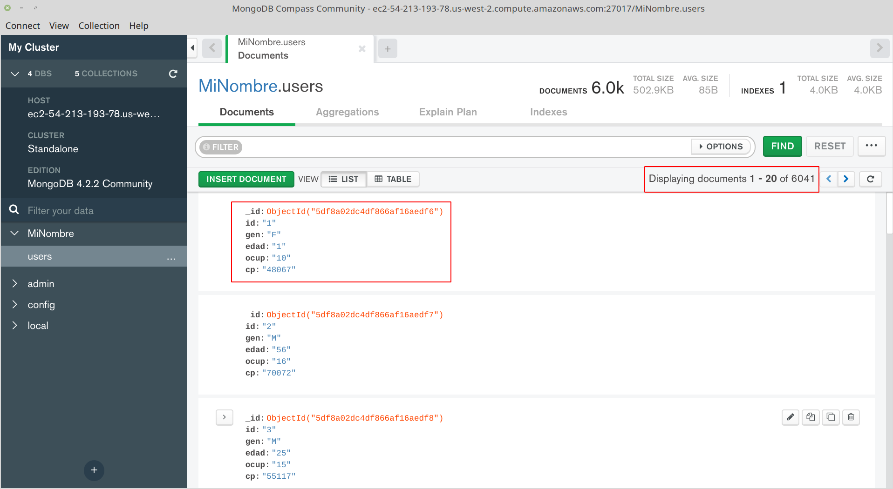

[`Introducción a Bases de Datos`](../../Readme.md) > [`Sesión 04`](../Readme.md) > Ejemplo 6

## Ejemplo 6: Realizando operaciones con Colecciones e importando datos

### 1. Objetivos :dart:
- Que el alumno realice operaciones con Colecciones
- Que el alumno cuente con una Colección para importar datos
- Que el alumno importe datos en formato CSV a una Colección

### 2. Requisitos :clipboard:
1. MongoDB Compass instalado
1. Datos de conexión al Servidor MongoDB

### 3. Desarrollo :rocket:
Las Colecciones en MongoDB son el equivalente a las Tablas en SQL, así que cada archivo en formato CSV necesita de una Coleción para poder ser importado.

A diferencia de SQL, las Colecciones sólo se crean y no es necesario definir campos y tipos de datos.

1. Partiendo de la lista de colecciones obtenida al final del ejemplo anterior, se procederá a crear una nueva colección llamada `movies`.

   
   
   Para crear una coleción, se presiona el botón `CREATE COLLECTION`, se escribe el nombre de la colección a crear y se presiona el botón `CREATE COLLECTION`

   
   
   Ahora se ve la lista de las bases de datos nuevamente, así que se dá clic sobre la base de datos con tu nombre y se verá algo similar a lo siguiente:

   

1. Para importar datos a una colección lo primero es seleccionar la colección dando clic sobre el nombre, en este caso `users`

   Una colección agrupa o almacena `Documentos`, que corresponden a `Registros` en SQL, al seleccionar la colección se muestra la lista de documentos:

   

   Como la colección se acaba de crear, la lista de documentos está vacía, así que para importar documentos, se usa la opción del menú `Collection > Import Data` que abre un diálogo para seleccionar del tipo de archivo y el archivo mismo.

   

   Importante seleccionar el formato CSV y al elegir el archivo, seleccionar el archivo `users.csv`, recuerda que este archivo incluye un primer registro con el nombre de las columnas, que `MongoDB` usará para crear los documentos (o registros)

   

   Ahora si ya aparecen documentos y se puede comprobar que cada campo tiene nombre y valor, así que la importación en relación a los campos es correcta

   Otro forma de comprobar la correcta importación es la cantidad de documentos, y se observa que hay 6040 documentos (o registros) en la colección, lo que indica que todo está en orden.

[`Anterior`](../Readme.md#realizando-operaciones-con-colecciones-e-importando-datos) | [`Siguiente`](../Reto-03/Readme.md)      
