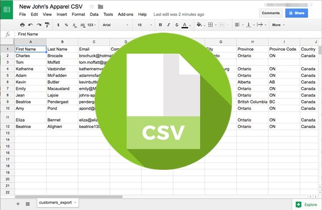

[`Introducción a Bases de Datos`](../Readme.md) > `Sesión 04`

## Sesión 4: Configuración de Bases de Datos Locales


<div style="text-align: justify;">

### 1. Objetivos :dart: 

- Configurar una base de datos de __MySQL__ localmente.
- Configurar una base de datos de __MongoDB__ en la nube.

### 2. Contenido :blue_book:

#### Parte I: Configuración de Bases Relacionales

---
##### <ins>Operaciones con bases de datos</ins>


Un servidor de bases de datos se compone de distintas bases de datos (esquemas) con propósitos distintos. Por ejemplo, podemos tener en un mismo servidor una base de datos de empleados y otra de productos, si se trata de una tienda, sin embargo, no necesariamente deben tener una relación directa.

Para crear bases de datos (esquemas), se usa el comando:

```sql
CREATE DATABASE <nombre>;
```

> *Explicar la diferencia entre servidor de base de datos y base de datos (esquema), así como ejemplos de creación de bases de datos.*

- [**`EJEMPLO 1`**](Ejemplo-01/Readme.md)

---
##### <ins>Realizando operaciones con tablas</ins>


Como hemos visto, una tabla se compone de renglones, columnas, tipos asociados a las columnas, llaves primarias y foráneas y por supuesto los valores que almacena.

Para crear una tabla se usa el comando (en su forma simple):

```sql
   CREATE TABLE (
      nombre tipo,
      ...
   );
```

> *Mostrar ejemplos de creación de tablas con llaves y los distintos tipos de datos de __MySQL__.*

- [**`EJEMPLO 2`**](Ejemplo-02/Readme.md)
- [**`RETO 1`**](Reto-01/Readme.md)

---
##### <ins>Importando datos a una tabla en formato CSV</ins>


Para cargar datos en una tabla o base de datos completa es usar que se deban utilizar archivos como lo son *CSV* o *JSON*. *CSV* es uno de los más utilizados y admitidos por __MySQL Workbench__.

Un archivo *CSV* se conforma de un encabezado que indica el nombre de las columnas separado por comas y cada uno de los registros, separando el valor para cada campo por comas. 

> *Mostrar algún archivo CSV y explicar cada una de sus partes.*

- [**`EJEMPLO 3`**](Ejemplo-03/Readme.md)
- [**`RETO 2`**](Reto-02/Readme.md)

---

#### Parte II: Configuración de Bases No Relacionales

---
##### <ins>Configuración de __MongoDB__ en la nube</ins>


Para facilitar la creación de servidores de bases de datos (llamados *clusters* pues se conforman de varios servidores a la vez), __MongoDB__ provee una plataforma que permite crear bases de datos en la nube de forma sencilla. 

Esta plataforma, llamada __Atlas__ permite crear un *cluster* de forma gratuita por lo que lo usaremos para ejemplificar este proceso. Puedes utilizarlo también para tu proyecto.

> *Explicar el concepto de base de datos en la nube y su principal diferencia con una base de datos local. Mostrar similudes con el servicio AWS de Amazon.*

- [**`EJEMPLO 4`**](Ejemplo-04/Readme.md)

---
##### <ins>Operaciones con bases de datos</ins>


Una vez configurado el *cluster* a partir de __MongoDB Atlas__, podemos conectar a la misma a través de __MongoDB Compass__ y por lo tanto podremos crear bases de datos desde aquí.

Lo único que solicita __MongoDB Compass__, a través de una interfaz gráfica, es el nombre de la base de datos.

Por cierto, __MongoDB Compass__ no es el único cliente de __MongoDB__, también existen otras herramientas como __Robo 3T__ o el *shell* de __MongoDB__.

> *Mostrar la pantalla de creación de bases de datos de Compass*.

- [**`EJEMPLO 5`**](Ejemplo-05/Readme.md)

---
##### <ins>Realizando operaciones con Colecciones e importando datos</ins>


Al igual que en __MySQL__ es posible cargar los datos usando formatos de intercambio de información como son __CSV__ o __JSON__. En el caso de __JSON__ se debe separar cada documento por comas.

- [**`EJEMPLO 6`**](Ejemplo-06/Readme.md)
- [**`RETO 3`**](Reto-03/Readme.md)

---
##### <ins>Realizando operaciones con Documentos</ins>


Una vez creada una colección, ya sea mediante la carga masiva de datos o de forma vacía. Es posible modificar los documento que se almacenan ahí. Es posible:

1. Agregar documentos
1. Editar documentos
1. Eliminar documentos

- [**`EJEMPLO 7`**](Ejemplo-07/Readme.md)

---

### 3. Ejercicios para practicar :hammer:

Aplica lo todo lo que aprendiste durante la sesión en este proyecto. 

- [**`EJERCICIOS SESIÓN 4`**](Ejercicios/Readme.md)

</br>

[`Anterior`](../Sesion-03/Readme.md) | [`Siguiente`](../Sesion-05/Readme.md)

</div>   
