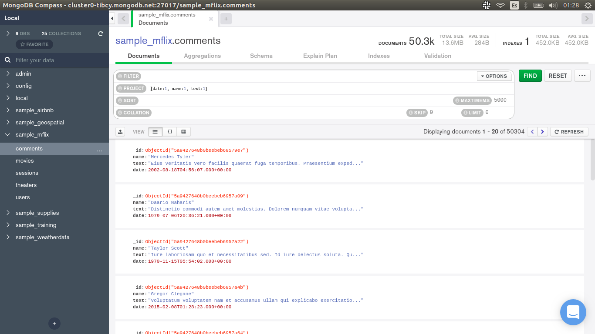
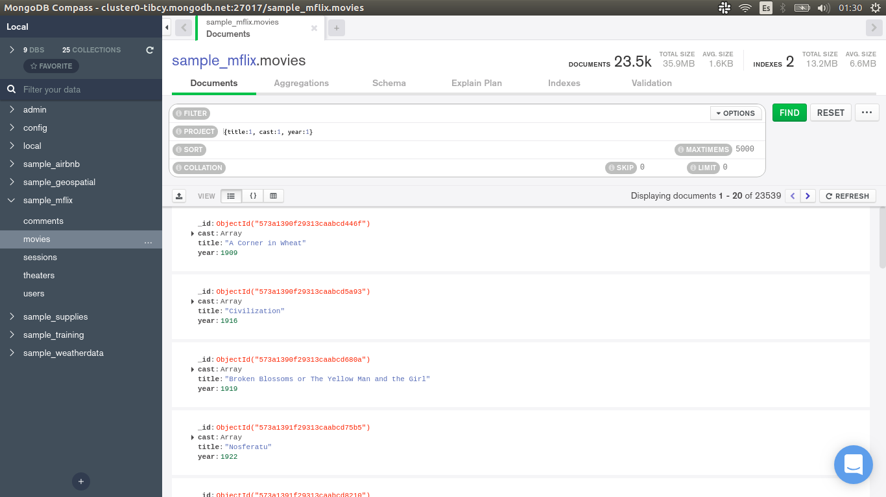
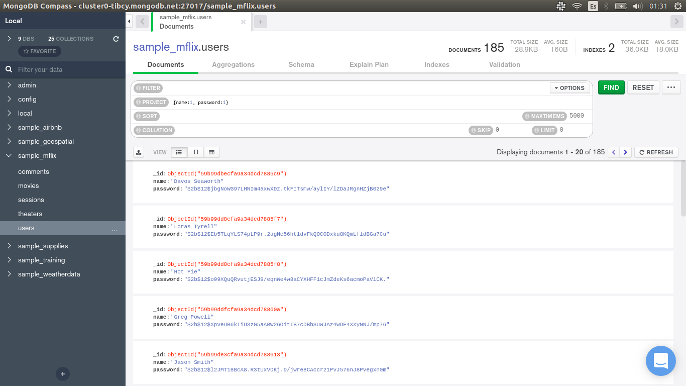

[`Introducción a Bases de Datos`](../../Readme.md) > [`Sesión 04`](../Readme.md) > `Reto 1`
	
## Reto 1: Colecciones, Documentos y Proyecciones

<div style="text-align: justify;">

### 1. Objetivos :dart:

- Proyectar columnas sobre distintos documentos para repasar algunos conceptos.

### 2. Requisitos :clipboard:

1. MongoDB Compass instalado.

### 3. Desarrollo :rocket:

Usando la base de datos `sample_mflix`, proyecta los datos que se solicitan.

- Fecha, nombre y texto de cada comentario.
- Título, elenco y año de cada película.
- Nombre y contraseña de cada usuario.

<details><summary>Solución</summary>
<p>

- Fecha, nombre y texto de cada comentario.

   ```json
   {date:1, name:1, text:1}
   ```
   
   

- Título, elenco y año de cada película.

   ```json
   {title:1, cast:1, year:1}
   ```
   
   
   
- Nombre y contraseña de cada usuario.

   ```json
   {name:1, password:1}	
   ```
    

</p>
</details> 

<br/>

[`Anterior`](../Ejemplo-02/Readme.md) | [`Siguiente`](../Readme.md#filtros-básicos)

</div>
