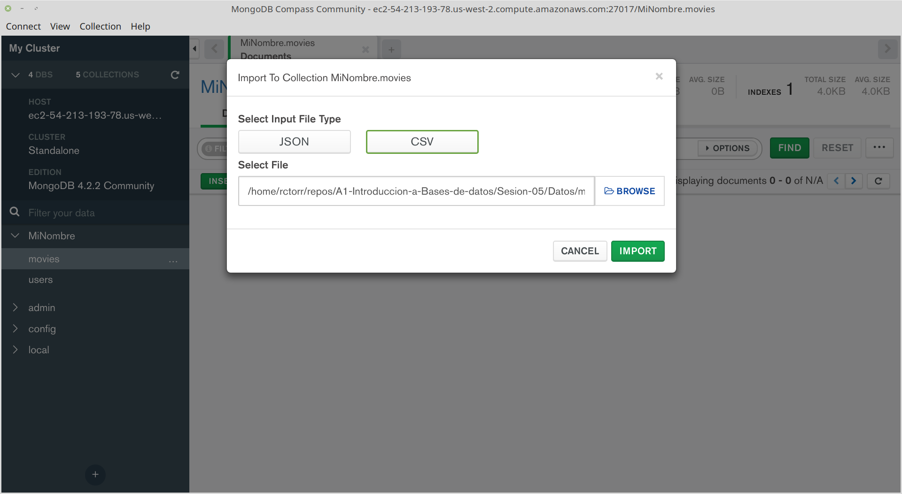
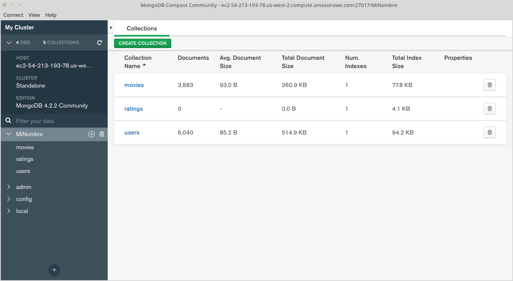

[`Introducción a Bases de Datos`](../../Readme.md) > [`Sesión 04`](../Readme.md) > Reto 3

## Reto 3: Realizando operaciones con Colecciones e importando datos

### 1. Objetivos :dart:
- Que el alumno cuente con una Colección para importar datos
- Que el alumno importe datos en formato CSV a una Colección

### 2. Requisitos :clipboard:
1. MongoDB Compass instalado
1. Datos de conexión al Servidor MongoDB

### 3. Desarrollo :rocket:
Se deberá de crear colecciones e importar los datos de los archivos `movies.csv` y `ratings.csv`.

1. Crear la colección `movies`

   

1. Importar datos a la colección `movies` desde el archivo `movies.csv`

   Para importar documentos, se usa la opción del menú `Collection > Import Data` que abre un diálogo para seleccionar del tipo de archivo CSV y el archivo mismo.

   

   Validar que cada campo tenga nombre y que estén todos los campos, además valida la cantidad de documentos, que en este caso debería de ser 3883.

1. Crear la colección `ratings`
   

   Seleccionar la colección y continuar.

1. Importar datos a la colección `ratings` desde el archivo `ratings.csv`

   Para importar usar la opción del menú `Collection > Import Data` que abre un diálogo para seleccionar del tipo de archivo CSV y el archivo mismo.

   Validar que cada campo tenga nombre y que estén todos los campos, además valida la cantidad de documentos, que en este caso debería de ser 1000209 documentos.

[`Anterior`](../Ejemplo-06/Readme.md) | [`Siguiente`](../Readme.md#3-proyecto-hammer)
