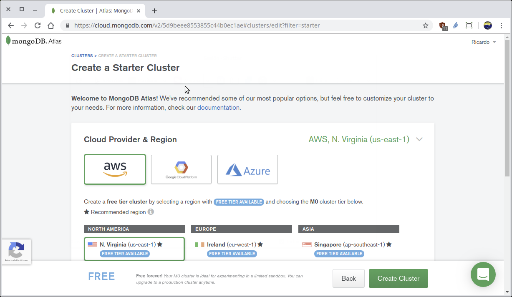
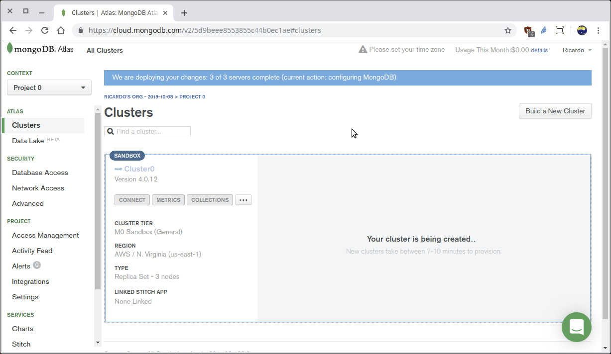
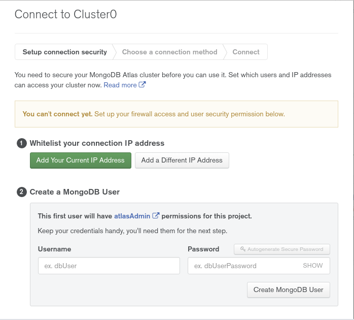
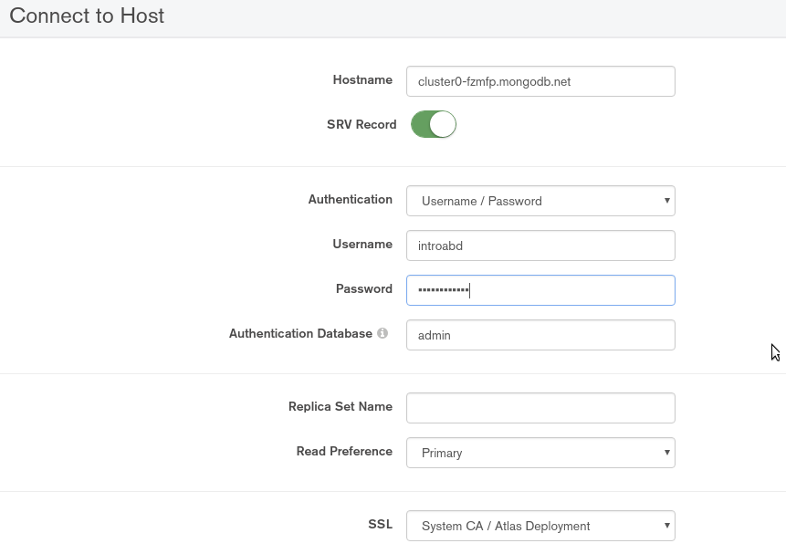
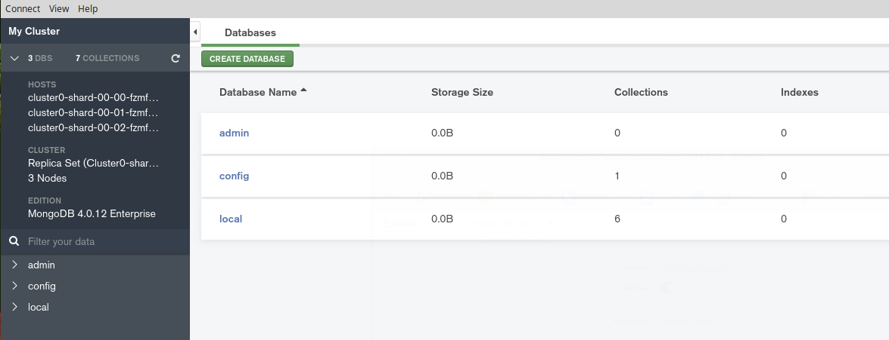

[`Introducción a Bases de Datos`](../../Readme.md) > [`Sesión 07`](../Readme.md) > Ejemplo 1

## Ejemplo 1: Configuración de __MongoDB__ en la nube

### 1. Objetivos :dart:
- Que el alumno configure MongoDB en la nube

### 2. Requisitos :clipboard:
- Ninguno

### 3. Desarrollo :rocket:
1. Para poder hacer uso de MongoDB en la nube se hará uso del servicio __Atlas__ proveeido por el propio equipo de MongoDB, abrir la siguiente url, llenar los campos del formulario y dar click en el botón de __Get srtarted free__

   URL: https://www.mongodb.com/cloud/atlas?jmp=docs

   

1. Elegir el tipo de __Cluster__, en donde se seleccionará __Starter Clusters__ que es el que es libre de costo, dar click en el botón __Create a Cluster__.

   
   Observar que con MongoDB Atlas se crean __Clusters__ y no __Servidores__.

1. Después se tienen que seleccionar las opciones para el __Starter Cluster__ y las opciones por omisión son las correctas (AWM Amazon, N. Virginia, M0 Sandbox, MongoDB 4.0, Cluster 0)

   
   Y presionar en el botón __Create Cluster__, lo que va a crear un __Cluster__ de trabajo, acción que puede demorar unos 5 mins.

   

   Cuando el __Cluster__ ya está creado se observa la página como la siguiente:

   

1. Lo que sigue es iniciar una conexión al cluster de MongoDB en la nube, esto se realiza dando click en el botón __CONNECT__

  

  MongoDB Atlas hace una validación y solicita definir qué dirección IP se va a conectar al servidor y qué usuario.

  Así que da click en el botón __Add Your Current IP Address__

  

  Se sugiere etiquetar la dirección IP, para llevar un registro de a quién corresponde cada IP y más adelante poder eliminar las direcciones que ya no sean necesarias.

  Después usar los siguientes datos para crear el usuario de acceso:

  - Usuario: introabd
  - Password: introabd1234

  

  Y presionar en el botón __Create MongoDB User__

  Y posteriormente se da click en el botón __Choose a connection method__ donde se seleccionará __Compass__ para continuar en el siguiente ejemplo.

  

1. Una vez creada la configuración en __MongoDB Atlas__ se realiza la conexión por medio de __MongoDB Compass__, así que estándo en la página de MongoDB Atlas se da click en la opción __Connect with MongoDB Compass__

   

   Después de dar click, se elige la opción donde ya tenemos __Compass__ instalado dando click en __I have Compass__.

   
   
   En el punto 1 la opción actual es la correcta y en el punto 2 se da click en el botón __Copy__

1. Si __MongoDB Compass__ está abierto es necesario cerrarlo y abrirlo nuevamente, al momento de iniciar, __Compass__ detecta la información copiada al portapapeles y pregunta si se desea usar la información para realizar la conexión:

   

   Dar click en el botón __Yes__ y __Compass__ en automático llena todos los campos de conexión, menos la clave, así que se teclea la clave y se da click en el botón __CONNECT__.

   
   Recuerda que los datos de conexión son:
   - Usuario: introabd
   - Clave: introabd1234

   __Nota:__ No usar este usuario para colocar información sensible.

   
   En este punto __Compass__ ya estará conectado al __Cluster0__ que como se puede ver en la columna izquierda consta de 3 instancias de MongoDB corriendo en paralelo, lo que se puede escalar según las necesidades.

[`Anterior`](../Readme.md#configuración-de-mongodb-en-la-nube) | [`Siguiente`](../Readme.md#operaciones-con-bases-de-datos-1)   
