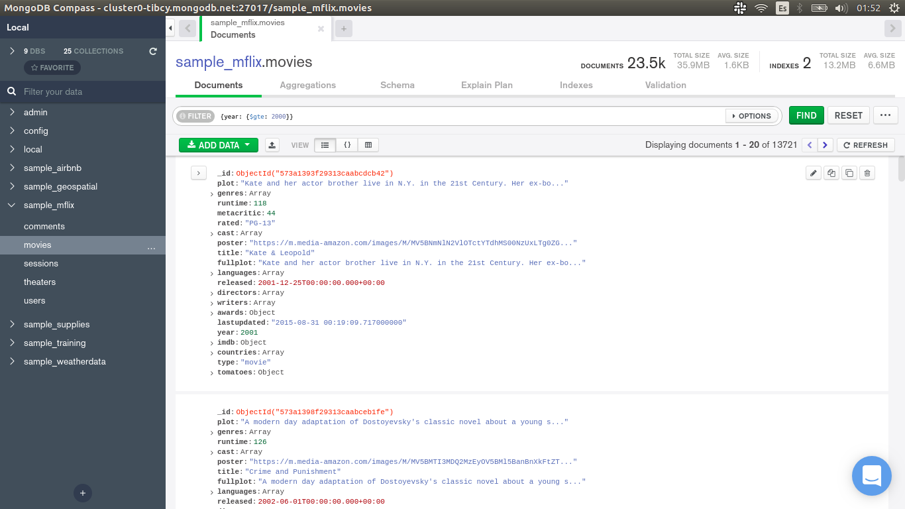
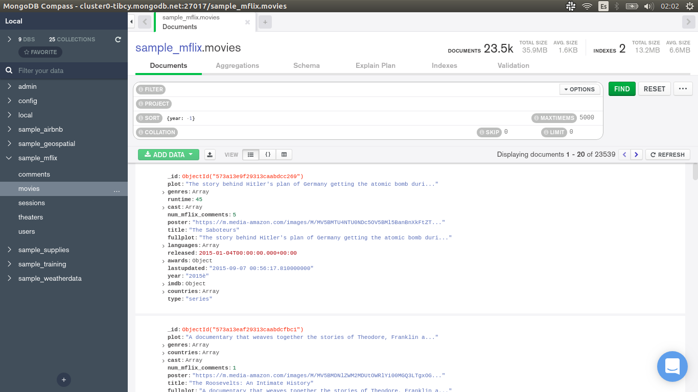

[`Introducción a Bases de Datos`](../../Readme.md) > [`Sesión 04`](../Readme.md) > `Ejemplo 4`

## Ejemplo 4: Filtros básicos

<div style="text-align: justify;">

### 1. Objetivos :dart:

- Usar la opción `FILTER` para filtrar documentos
- Usar la opción `ORDER` para ordenar documentos
- Usar la opción `LIMIT` para limitar documentos

### 2. Requisitos :clipboard:

1. MongoDB Compass instalado.

### 3. Desarrollo :rocket:

1. Dentro de la colección `movies`, vuelve a dar clic en el botón `OPTIONS`.  Esta vez usaremos el campo `FILTER`, esta opción es equivalente a la cláusula `WHERE` de SQL. Por ejemplo, podemos filtrar todas las películas del año 1993.

   *Consulta en SQL*
  
   ```sql
   SELECT *
   FROM movies
   WHERE year = 1993;
   ```
  
   *Consulta en MongoDB usando JSON*
  
   ```json
   {year: 1993}
   ```

    

2. Al igual que en SQL, tenemos operadores relacionales, por ejemplo queremos todas las películas de los años 2000.

   *Consulta en SQL*
   
   ```sql
   SELECT *
   FROM movies
   WHERE year >= 2000;
   ```
   
   *Consulta en MongoDB usando JSON*
   
   ```json
   {year: {$gte: 2000}}
   ```
   
   *Observación:* Las operaciones de MongoDB siempre aparecen precedidas del símbolo `$`.
   
   

3. También tenemos las operaciones lógica. Por ejemplo, si quisiéramos las películas comprendidas entre el año 2012 y 2019.

   *Consulta en SQL*
   
   ```sql
   SELECT *
   FROM movies
   WHERE year >= 2012
     AND year <= 2019;
   ```
   
   *Consulta en MongoDB usando JSON*
   
   ```json
   {$and: [{year: {$gte: 2012}},{year: {$lte: 2019}}]}
   ```
   
   *Observación:* Las operaciones que reciben más de un argumento, usan arreglos para separar los mismos.

   
   
   Para conocer más operaciones de este tipo, revisa la [documentación de MongoDB](https://docs.mongodb.com/manual/reference/operator/query/). 
   
4. Para ordenar, usaremos la opción `SORT`. Para ordenar, hay que agregar un JSON con el nombre de los campos por los cuales se desea ordenar y agregar un valor 1 si se desea ordenar ascendentemente o -1 para un ordenamiento descendente. Por ejemplo, ordenaremos las películas por año.

   *Consulta en SQL*

   ```sql
   SELECT *
   FROM movies
   ORDER BY year ASC;
   ```
   
   *Consulta en MongoDB usando JSON*
   
   ```json
   {year: 1}
   ```
   
   
   
    *Consulta en SQL*

   ```sql
   SELECT *
   FROM movies
   ORDER BY year DESC;
   ```
   
   *Consulta en MongoDB usando JSON*
   
   ```json
   {year: -1}
   ```
   
   
   
5. Finalmente, para limitar los resultados de una consulta, podemos usar la opción `LIMIT`. Sólo basta con agregar el número deseado. Por ejemplo, las cinco películas de los últimos años.

   

[`Anterior`](../Readme.md#filtros-básicos) | [`Siguiente`](../Reto-02/Readme.md)

</div>
