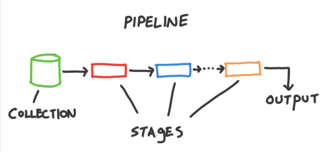

[`Introducción a Bases de Datos`](../Readme.md) > `Sesión 5`

## Sesión 5: Fundamentos de MongoDB


<div style="text-align: justify;">

### 1. Objetivos :dart: 

- Analizar la estructura de distintas colecciones en una base de datos
- Realizar consultas básicas que permitan filtrar documentos, ordenar y limitar los resultados

### 2. Contenido :blue_book:

---

#### <ins>Bases de Datos Relacionales vs. No Relacionales</ins>


Comcencemos la sesión con un pequeño debate. :open_mouth:

1. Para comenzar contesta las siguientes preguntas:

   - ¿Cuáles son los principales elementos de una base de datos relacional?
   - ¿Cuáles son los principales elementos de una base de datos no relacional (*NoSQL*)?
   - ¿Qué ventajas tiene usar una base de datos relacional?
   - ¿Qué ventajas tiene usar una base de datos no relacional?
   - ¿Cuál es el mejor tipo de base de datos entonces?

2. Comenta tus respuestas con el grupo.

---
#### <ins>Colecciones, Documentos y Proyecciones</ins>


En __MongoDB__ los datos son almacenados en *colecciones* que incluyen documentos. Estos documentos se representan usando el formato de intercambio de información __JSON__. El formato __JSON__ se conforma de un conjunto de elementos de la forma *clave-valor* separados por comas y delmitados por llaves. Los tipos de datos de __JSON__ son:

- Números
- Booleanos
- Cadenas
- Arreglos
- Objetos

Para realizar consultas u otras operaciones en __MongoDB__ debe usarse este formato a manera de lenguaje (no es un lenguaje por sí mismo, pero lo usaremos como si lo fuera). En particular, para realizar proyecciones, se usa este formato. Debe indicarse el campo a proyectar y colocar un uno si queremos mostrarlo o cero en caso contrario.

- `{campo: 0}`
- `{campo: 1}`

- [**`EJEMPLO 1`**](Ejemplo-01/Readme.md)
- [**`RETO 1`**](Reto-01/Readme.md)	

---
#### <ins>Filtros básicos</ins>


Al igual que con las proyecciones, los filtros se construyen usando __JSON__. En su forma más básica se debe escribir el nombre del campo, dos puntos y el valor que queremos filtrar. Existen varias funciones que se pueden combinar con los filtros y las iremos estudiando a lo largo del módulo.

```json
{campo: "valor"}
```

- [**`EJEMPLO 2`**](Ejemplo-02/Readme.md)
- [**`RETO 2`**](Reto-02/Readme.md)

---

### 3. Ejercicios para practicar :hammer:

Aplica lo todo lo que aprendiste durante la sesión en esta serie de ejercicios. 

- [**`Ejercicios Sesión 5`**](Ejercicios/Readme.md)

</br>

[`Anterior`](../Sesion-04/Readme.md) | [`Siguiente`](../Sesion-06/Readme.md)

</div>	
