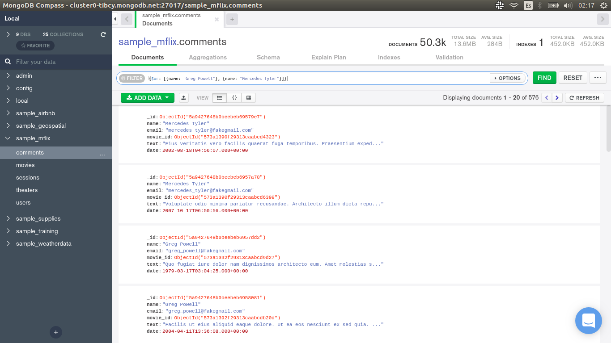
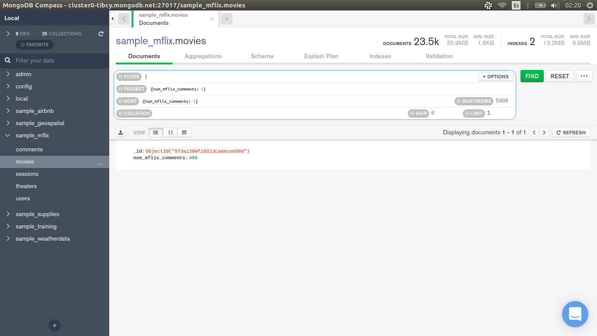
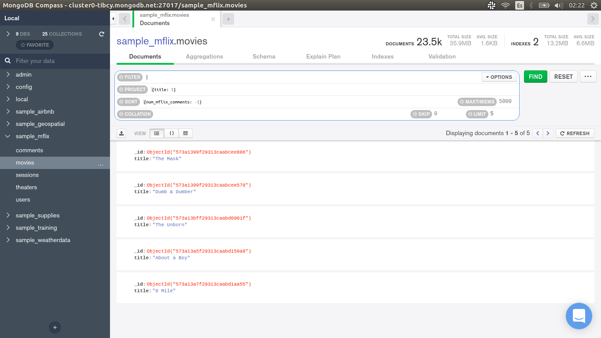

[`Introducción a Bases de Datos`](../../Readme.md) > [`Sesión 04`](../Readme.md) > `Reto 2`
	
## Reto 2: Filtros básicos

<div style="text-align: justify;">

### 1. Objetivos :dart:

- Proyectar columnas sobre distintos documentos para repasar algunos conceptos.

### 2. Requisitos :clipboard:

1. MongoDB Compass instalado.

### 3. Desarrollo :rocket:

Usando la base de datos `sample_mflix`, agrega proyeccciones, filtros, ordenamientos y límites que permitan contestar las siguientes preguntas.

- ¿Qué comentarios ha hecho Greg Powell?
- ¿Qué comentarios han hecho Greg Powell o Mercedes Tyler?
- ¿Cuál es el máximo número de comentarios en una película?
- ¿Cuál es título de las cinco películas más comentadas?

<details><summary>Solución</summary>
<p>

- ¿Qué comentarios ha hecho Greg Powell?

   ```json
   {name: "Greg Powell"}
   ```
   
   

- ¿Qué comentarios han hecho Greg Powell o Mercedes Tyler?

   ```json
   {$or: [{name: "Greg Powell"}, {name: "Mercedes Tyler"}]}
   ```
   
   
   
- ¿Cuál es el máximo número de comentarios en una película?

   Para responder esta pregunta, necesitamos tres cosas.
   
   1. Proyectar el número de comentarios

   ```json
   {num_mflix_comments: 1}	
   ```
   
   2. Ordenar el número de comentarios de forma descendente.
   
   ```json
   {num_mflix_comments:-1}
   ```
   
   3. Limitar los resultados a 1.
   
    
   
- ¿Cuál es título de las cinco películas más comentadas?

   Para responder esta pregunta, necesitamos tres cosas.
   
   1. Proyectar el título de las películas.

   ```json
   {title: 1}	
   ```
   
   2. Ordenar el número de comentarios de forma descendente.
   
   ```json
   {num_mflix_comments: -1}
   ```
   
   3. Limitar los resultados a 5.
   
      

</p>
</details> 

<br/>

[`Anterior`](../Ejemplo-03/Readme.md) | [`Siguiente`](../Readme.md#3-proyecto-hammer)

</div>
