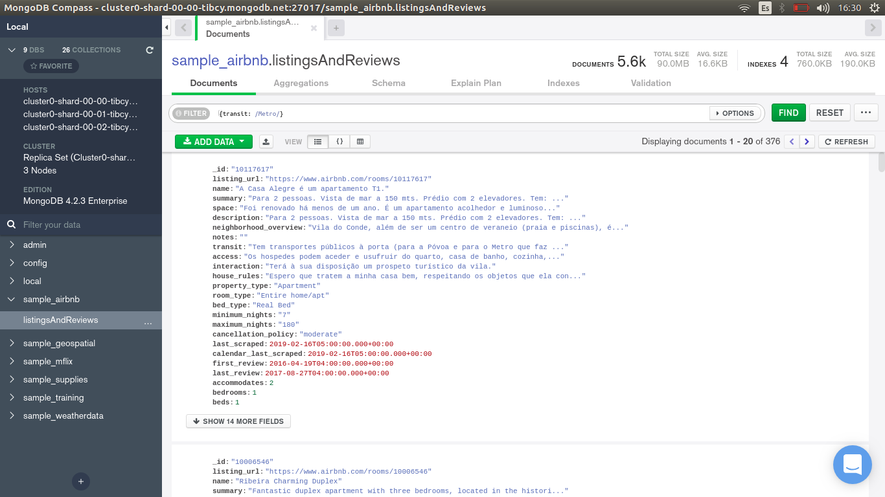
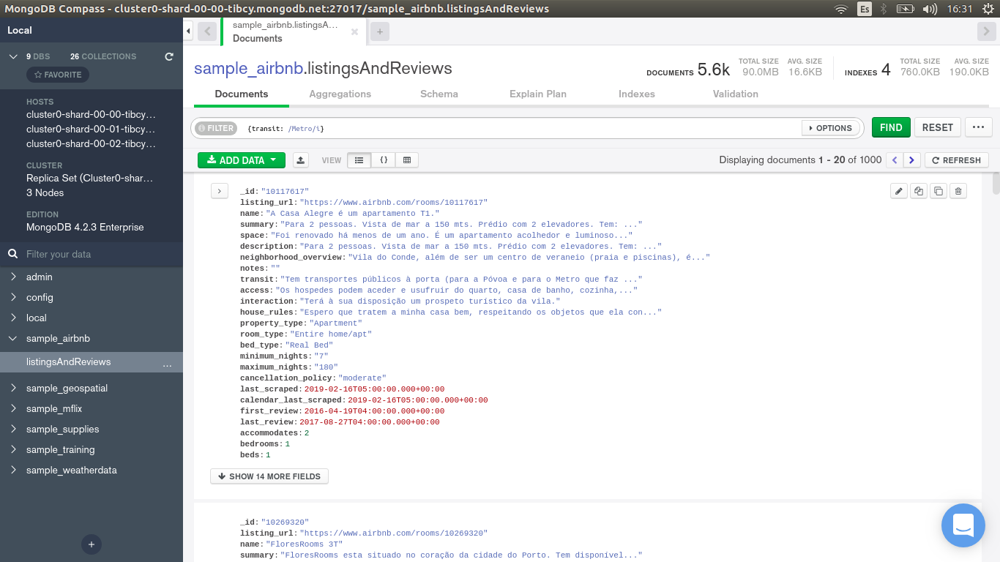
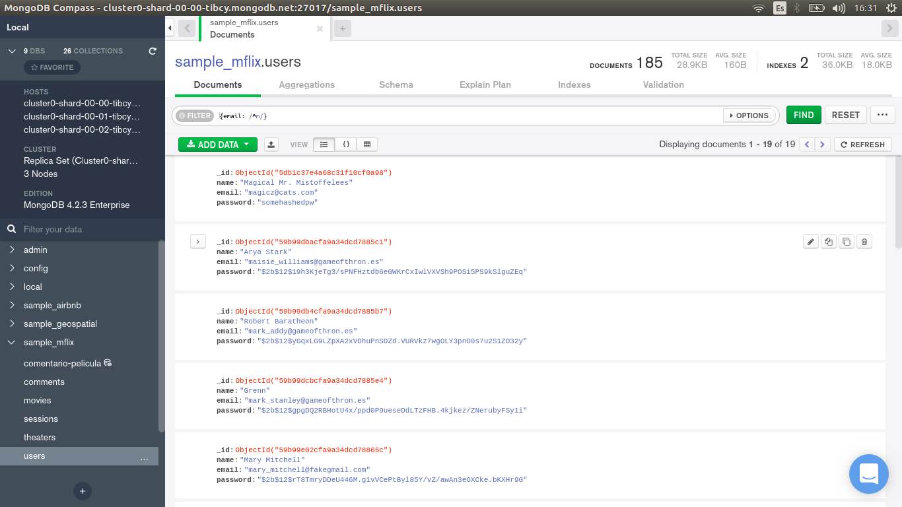
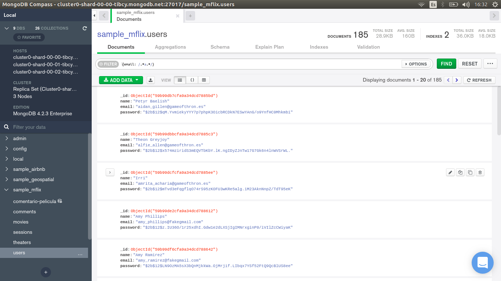

[`Introducción a Bases de Datos`](../../Readme.md) > [`Sesión 05`](../Readme.md) > `Ejemplo 1`

## Ejemplo 1: Expresiones regulares

<div style="text-align: justify;">

### 1. Objetivos :dart: 

- Conocer la estructura básica de una expresión regular.
- Escribir consultas que hagan uso de filtros.

### 2. Requisitos :clipboard:

1. MongoDB Compass instalado.

### 3. Desarrollo :rocket:

En este ejemplo revisaremos el concepto de expresión regular. Éste es similar a las expresiones `LIKE` que usamos en __MySQL__ y nos permitirá realizar búsquedas por medio de patrones. 

1. Las expresiones regulares en MongoDB siguen un estándar, toda la información acerca de la sintaxis, puedes encontrarla en la siguiente [página](https://www.w3schools.com/jsref/jsref_obj_regexp.asp).

   - Para iniciar, conectate al servidor de bases de datos del curso, las credenciales te las proporcionará el experto que te fue asignado, si tienes dudas, consútalo.
   
   - Comencemos con un filtro sencillo. Dentro de la colección `sample_airbnb.listingsAndReviews` vamos a buscar aquellas propiedades que estén cerca de una estación del metro. Para ello, buscaremos la palabra `Metro`. Para ello, escribimos la siguiente consulta, recuerda que las expresiones se delimitan por diagonales.
   
      ```json
      {transit: /Metro/}
      ```
      
      
      
   - La consulta anterior parece funcionar, pero qué ocurre si el dueño puso en la descripción metro con minúsculas, todos esos documentos están siendo omitidos. Le pediremos a MongoDB que haga la búsqueda ignorando las mayúsculas y minúsculas agregando el modificador `i`.
   
      ```json
      {transit: /Metro/i}
      ```
      
      
      
   Como puedes observar, la consulta trajo más registros pues en esta ocasión, estamos obteniendo documentos con la palabra `Metro` o `metro`.   

2. También podemos buscar patrones por secciones de la misma forma que lo hacíamos con los símbolos de `%` y `_` en __SQL__. Por ejemplo, dentro de la colección `sample_mflix.users` podemos obtener todos los correos electrónicos que inician con `m`. 

   Para esto, necesitamos detectar el inicio de una cadena, para ello, se usa el símbolo `^`.
   
   ```json
   {email: /^m/}
   ```
   
   Recuerda colocar las diagonales.
   
   
   
3. De la misma manera, podemos buscar los correos que tengan dominio `@cats.com`, para ello, debemos buscar correos que tengan al final el texto mencionado. Para ello usamos el símbolo `$` que marca el fin de una cadena.

   ```json
   {email: /@cats.com$/}
   ```
   
   
   
4. Por último, buscaremos documentos cuyo correo incluya una `a` en cualquier parte del mismo. Para ello usaremos la expresión `.*` que se sustituye por cualquier cadena.

   ```json
   {email: /.*a.*/}
   ```
   
     

[`Anterior`](../Readme.md#expresiones-regulares) | [`Siguiente`](../Reto-01/Readme.md)

</div>
