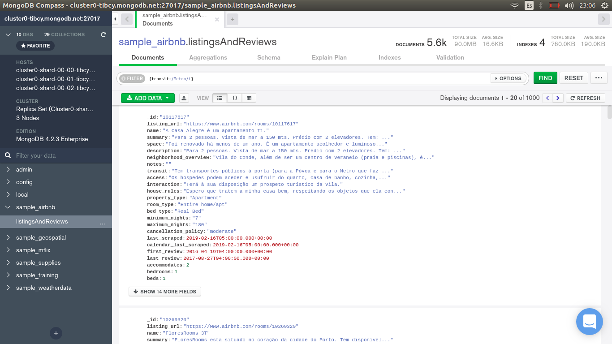
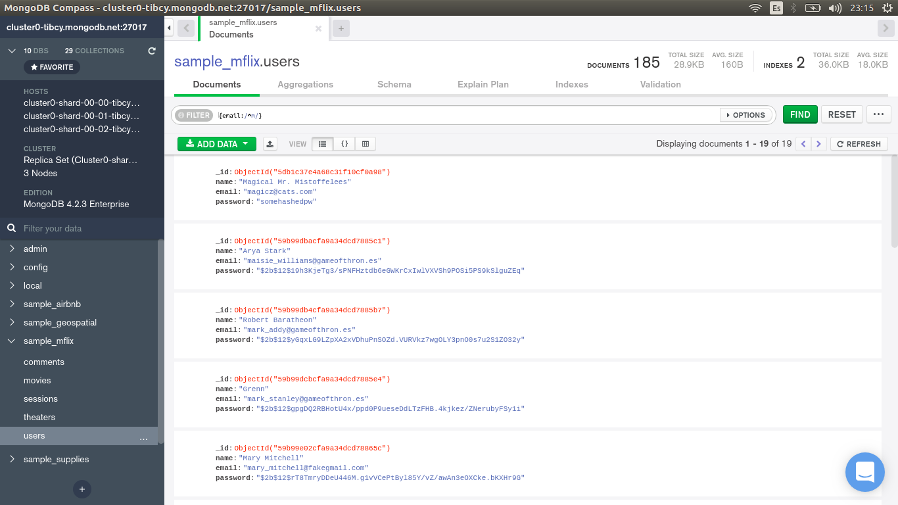

[`Introducción a Bases de Datos`](../../README.md) > [`Sesión 06`](../Readme.md) > `Reto 1`
	
## Reto 1: Expresiones regulares

<div style="text-align: justify;">

### 1. Objetivos :dart: 

- Poner en práctica el uso de expresiones regulares.

### 2. Requisitos :clipboard:

1. MongoDB Compass instalado.

### 3. Desarrollo :rocket:

Usando la base de datos `sample_airbnblistingsAndReviews`, realiza los siguientes filtros:

- Propiedades que no permitan fiestas.
- Propiedades que admitan mascotas.
- Propiedades que no permitan fumadores.
- Propiedades que no permitan fiestas ni fumadores.

<details><summary>Solución</summary>
<p>

- Propiedades que no permitan fiestas.

   ```json
   {house_rules: /No Parties/i}
   ```
   
   

- Propiedades que admitan mascotas.

   ```json
   {house_rules: /Pets Allowed/i}
   ```
   
   
   
- Propiedades que no permitan fumadores.

   ```json
   {house_rules: /No Smoking/i}	
   ```
    
   
- Propiedades que no permitan fiestas ni fumadores.

   ```json
   {house_rules: /No Smoking|No Parties/i}
   ```
   
   


</p>
</details>

<br/>

[`Anterior`](../Ejemplo-01/Readme.md) | [`Siguiente`](../Readme.md)

</div>
