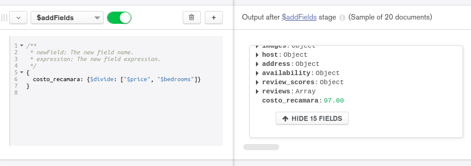
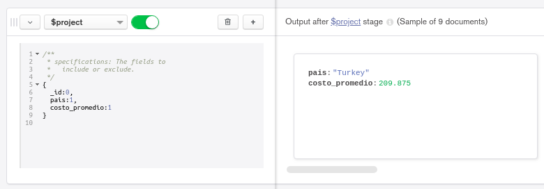

[`Introducción a Bases de Datos`](../../Readme.md) > [`Sesión 06`](../Readme.md) > `Reto 1`
	
## Reto 1: Agrupamientos

<div style="text-align: justify;">

### 1. Objetivos :dart: 

- Poner en práctica el uso de agrupamientos.

### 2. Requisitos :clipboard:

1. MongoDB Compass instalado.

### 3. Desarrollo :rocket:

Con base en el ejemplo 1, modifica el agrupamiento para que muestre el costo promedio por habitación por país de las propiedades de tipo casa.

<details><summary>Solución</summary>
<p>

- Filtramos las propeidades con `$match`

   ```json
   {
      property_type: 'House',
      bedrooms: {$gte: 1}
   }
   ```
   
   
   
- Agregamos el costo por recámara con `$addFields`

   ```json
   {
      costo_recamara: {$divide: ["$price", "$bedrooms"]}
   }
   ```

   
   
- Agrupamos la suma de recamaras y del total agrupando en este caso por país. Para ello usamos `$group`.

   ```json
   {
     _id: "$address.country",
     recamaras: {
       $sum: 1
     },
     total: {
       $sum: "$costo_recamara"
     }
   }
   ```
   
   
   
- Agregamos el campo costo promedio para cada pas con `$addFields`, creamos un alias al `_id` para hacer más claro el valor que guarda.

   ```json
   {
     pais: "$_id",
     costo_promedio: {$divide: ["$total", "$recamaras"]}
   }
   ```
   
   
   
- Agregamos una proyección para quitar campos irrelevantes con `project`.

   ```json
   {
     _id:0,
     pais:1,
     costo_promedio:1
   }
   ```
   
   
 
</p>
</details> 

<br/>

[`Anterior`](../Ejemplo-01/Readme.md) | [`Siguiente`](../Readme.md#asociación-de-colecciones)   
