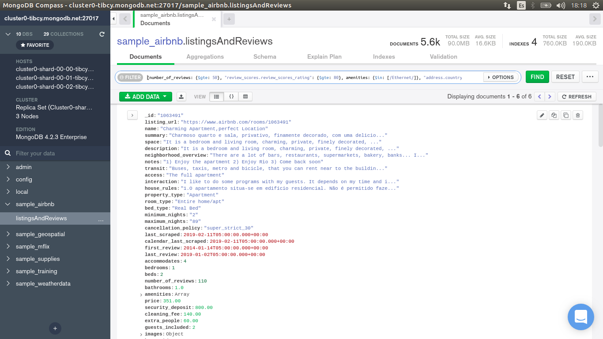

[`Introducción a Bases de Datos`](../../Readme.md) > [`Sesión 05`](../Readme.md) > `Reto 2`
	
## Reto 2: Notación punto y arreglos

<div style="text-align: justify;">

### 1. Objetivos :dart: 

- Proyectar columnas sobre distintos documentos para repasar algunos conceptos.

### 2. Requisitos :clipboard:

1. MongoDB Compass instalado.

### 3. Desarrollo :rocket:

Usando la colección `sample_airbnb.listingsAndReviews`, agrega un filtro que permita obtener todas las publicaciones que tengan 50 o más comentarios, que la valoración sea mayor o igual a 80, que cuenten con conexión a Internet vía cable y estén ubicada en Brazil.

<details><summary>Solución</summary>
<p>

```json
{number_of_reviews: {$gte: 50}, "review_scores.review_scores_rating": {$gte: 80}, amenities: {$in: [/Ethernet/]}, "address.country_code": "BR" }
```

   

</p>
</details> 

<br/>

[`Anterior`](../Ejemplo-02/Readme.md) | [`Siguiente`](../Readme.md#introducción-a-las-agregaciones)

</div>
