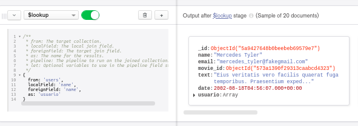
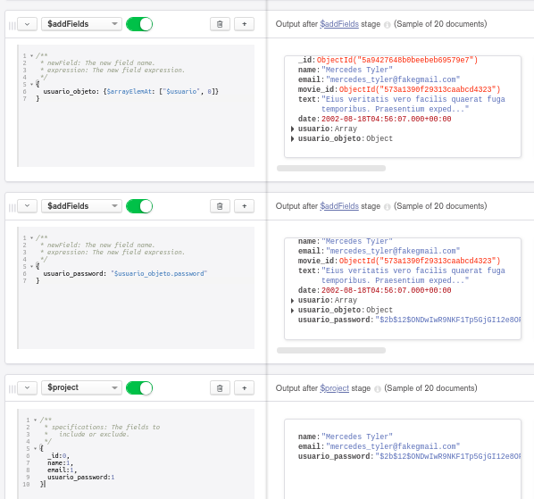

[`Introducción a Bases de Datos`](../../Readme.md) > [`Sesión 06`](../Readme.md) > `Reto 2`
	
## Reto 2: Asociación de colecciones

<div style="text-align: justify;">

### 1. Objetivos :dart: 

- Proyectar columnas sobre distintos documentos para repasar algunos conceptos.

### 2. Requisitos :clipboard:

1. MongoDB Compass instalado.

### 3. Desarrollo :rocket:

Usando las colecciones `comments` y `users`, se requiere conocer el correo y contraseña de cada persona que realizó un comentario. Construye un pipeline que genere como resultado estos datos.

**NO CIERES ESTE *PIPELINE* PUES LO USAREMOS MÁS ADELANTE**

<details><summary>Solución</summary>
<p>
	
Primero, obtenemos la relación con `$lookup`.	

```json
{
  from: 'users',
  localField: 'name',
  foreignField: 'name',
  as: 'usuario'
}
```



Posteriormente, obtenemos el objeto del arreglo, su campo `password` y finalmente proyectamos los datos necesarios.

- `$addFields`

```json
{
  usuario_objeto: {$arrayElemAt: ["$usuario", 0]}
}
```

- `$addFields`

```json
{
  usuario_password: "$usuario_objeto.password"
}
```

- `$project`

```json
{
  _id:0,
  name:1,
  email:1,
  usuario_password:1
}
```



</p>
</details> 

<br/>

[`Anterior`](../Ejemplo-02/Readme.md) | [`Siguiente`](../Readme.md#generación-de-vistas)   

</div>
