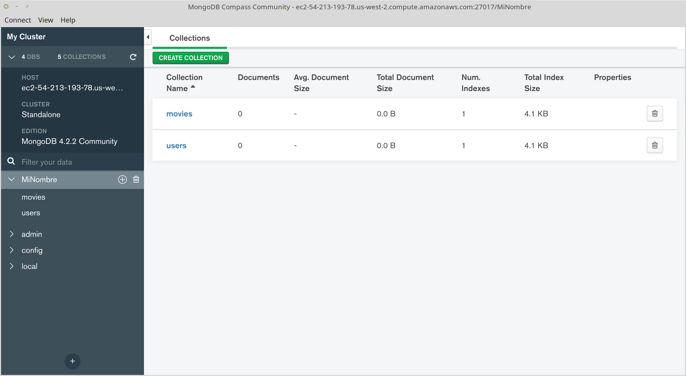

[`Introducción a Bases de Datos`](../../Readme.md) > [`Sesión 07`](../Readme.md) > Reto 3

## Reto 3: Realizando operaciones con Colecciones e importando datos

### 1. Objetivos :dart:
- Que el alumno cuente con una Colección para importar datos
- Que el alumno importe datos en formato CSV a una Colección

### 2. Requisitos :clipboard:
1. MongoDB Compass instalado
1. Datos de conexión al Servidor MongoDB

### 3. Desarrollo :rocket:
Se deberá de crear colecciones e importar los datos de los archivos `movies.csv` y `ratings.csv`.

1. Crear la colección `movies`
   

1. Importar datos a la colección `movies` desde el archivo `movies.csv`

   Para importar documentos, se usa la opción del menú `Collection > Import Data` que abre un diálogo para seleccionar del tipo de archivo CSV y el archivo mismo.
   

   Validar que cada campo tenga nombre y que estén todos los campos, además valida la cantidad de documentos, que en este caso debería de ser 3883.

1. Determinar cual es el registro extra en la colección `movies`, para ello se da clic en el botón `OPTION` y en la línea que dice `SORT` se escribe lo siguiente:
   ```json
   {id:1}
   ```
   Esto indica que los resultados se ordenen en base al campo `id` de forma ascendente, dar clic en el botón `FIND` o presionar la tecla `ENTER` para actualizar la lista de registros.
   

   Donde el primer documento está vació, así que se procede a eliminar este documento en blanco presionando el icono de bote de basura para el primer documento.

   Después entonces el total de documentos es 3883 como era de esperar.

1. Crear la colección `ratings`
   

   Seleccionar la colección y continuar

1. Importar datos a la colección `ratings` desde el archivo `Datos/ratings-h.csv`

   Para importar usar la opción del menú `Collection > Import Data` que abre un diálogo para seleccionar del tipo de archivo CSV y el archivo mismo.

   Es posible que al importar se obtenga un mensaje de error de `timeout`, así que se procede a dar click en el botón `OPTIONS` y se modifica el valor de `MAXTIMEMS` a 120000, se elimina la colección, se crea nuevamente y se realiza la importación de datos de nuevo.

   __Nota:__ Si no fuera posible realizar la importación de todos los registros, realizar la importación donde más registros se hayan importado y proceder a eliminar registros vacíos.

   Validar que cada campo tenga nombre y que estén todos los campos, además valida la cantidad de documentos, que en este caso debería de ser 1000209 documentos.

1. Determinar cual es el registro extra en la colección `ratings`, para ello se da click en el botón `OPTION` y en la línea que dice `SORT` se escribe lo siguiente:
   ```json
   {userid:1}
   ```
   Esto indica que los resultados se ordenen en base al campo `userid` de forma ascendente, dar click en el botón `FIND` o presionar la tecla `ENTER` para actualizar la lista de registros.

   Se observa que los primeros documentos están vacíos, así que se procede a eliminarlos.

   
   Después entonces el total de documentos es 1000209 como era de esperar. 

[`Anterior`](../Ejemplo-06/Readme.md) | [`Siguiente`](../Readme.md#3-proyecto-hammer)
