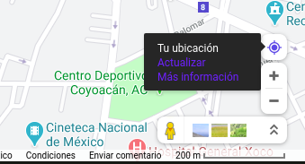
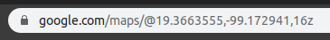

[`Introducción a Bases de Datos`](../../Readme.md) > [`Sesión 8`](../Readme.md) > Reto 1

## Reto 1: Starbucks

### 1. Objetivos :dart:
- Resolver este reto mediante la creación de bases de datos y generación de consultas

### 2. Requisitos :clipboard:
- Servidor __MySQL__ o __MongoDB__ instalado, puedes usar también los servidores que __BEDU__ ha dispuesto para ti en este módulo.
- De preferencia trabaja en equipos de no más de tres personas.

### 3. Desarrollo :rocket:

1. Descarga la fuente de datos de los locales de Starbucks:

   <a href="datos/directory.csv" target="_blank">`directory.csv`</a>

1. Analiza los datos, limpia los datos en caso de ser necesario.

1. Elige __MySQL__ o __MongoDB__ y crea una base de datos para el conjunto de datos del reto.

1. Carga los datos en la base de datos que elegiste y revisa que éstos se muestren correctamente.

1. Usando la latitud y longitud de tu posición actual, encuenta el Starbucks más cercano a tu posición. Para conocer tu posición actual puedes usar Google Maps para, sólo debes copiar los datos de la URL.

   

   

 

[`Anterior`](../Readme.md#starbucks) | [`Siguiente`](../Readme.md#pandemia-a-h1n1)   
